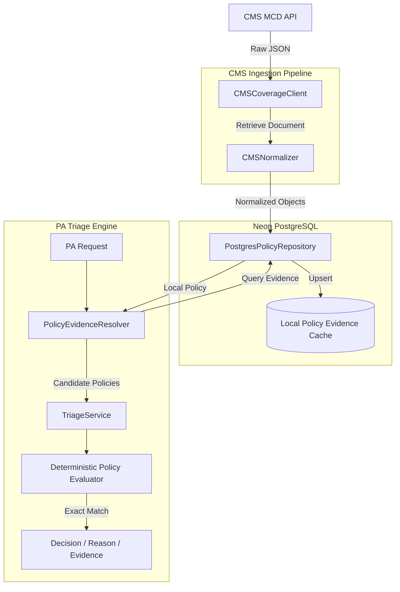
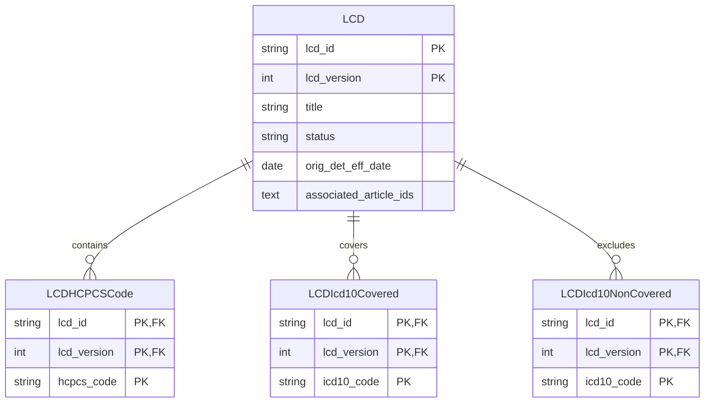

# AI-Powered Prior Authorization Triage & Policy Companion

> An explainable Prior Authorization triage system that combines clinical request normalization, CMS Medicare coverage evidence, deterministic policy evaluation, and safe routing for manual review.

## 1. Problem Statement

Prior Authorization (PA) is a utilization management process used by health insurers to determine if a prescribed procedure, service, or medication is medically necessary and covered under a patient's plan before it is rendered. Payer organizations need PA to control costs and ensure adherence to evidence-based medical guidelines. 

However, evaluating PA requests requires reviewing complex clinical notes, procedure details, and diagnosis codes against lengthy, dense coverage policies (like Medicare's Local Coverage Determinations). Manual review is notoriously slow, leading to care delays, administrative burnout, and friction between providers and payers. Missing or incorrectly formatted clinical information creates unnecessary denials and appeals loops. Furthermore, inconsistent policy interpretation by reviewers results in unreliable outcomes. A system is needed to traceably connect patient clinical data to specific policy evidence to accelerate review and eliminate arbitrary denials.

## 2. Solution

This project provides an automated, explainable triage and decision-support system. It acts as a deterministic policy companion to intelligently route PA requests.

The workflow is as follows:
1. **Receive PA request:** Accept standard clinical and administrative data.
2. **Extract relevant information:** Identify procedure and diagnosis codes.
3. **Normalize codes:** Standardize HCPCS and ICD-10 formats.
4. **Identify applicable policy evidence:** Find policies governing the requested procedure.
5. **Query local policy database:** Check for normalized CMS policy evidence stored locally.
6. **Use CMS-derived policy evidence:** Use fallback data ingestion to cache required policies from CMS.
7. **Evaluate coverage criteria:** Compare requested codes against structured policy lists.
8. **Identify missing information:** Detect discrepancies between submitted codes and covered codes.
9. **Produce recommendation:** Suggest `APPROVE`, `PEND`, or `REQUEST_MORE_INFORMATION`.
10. **Explain reasoning and evidence:** Surface human-readable explanations mapping exactly to CMS policy requirements.

This system provides a **decision recommendation** and acts as **decision support**. It automatically approves straightforward, fully-covered cases while safely routing complex or incomplete cases for manual review. It does not replace final insurance adjudication.

## 3. Key Features

### Prior Authorization Intake
- **PA request processing:** Accepts procedure, diagnosis, administrative state, and age information.
- **Clinical information parsing:** Captures clinical notes to provide semantic context for evaluation.

### Code Normalization
- **HCPCS / CPT:** Standardizes and validates procedure codes.
- **ICD-10-CM:** Standardizes and validates diagnosis codes.

### CMS Coverage Integration
- **CMS Medicare Coverage Database (MCD):** Integrates directly with official Medicare policy APIs.
- **CMS Coverage API:** Authenticates dynamically using license agreement tokens.
- **Document retrieval:** Fetches LCDs (Local Coverage Determinations) and associated metadata.
- **CMS document normalization:** Normalizes messy raw API JSON into relational policy objects.

### Local Policy Knowledge Base
- **PostgreSQL on Neon:** Stores high-performance relational policy cache.
- **SQLAlchemy ORM:** Maps Python classes to the policy data structure.
- **Normalized policy data:** Maintains `HCPCS` relationships, `ICD-10` covered/non-covered relationships.
- **Policy metadata:** Tracks policy versions, effective dates, and jurisdiction mappings.

### Policy Evaluation
- **Deterministic Evaluation:** Uses exact-string matching to evaluate procedure and diagnosis codes against structured LCD/Article lists, avoiding LLM hallucinations on strict billing codes.

### Explainability
- **Decision reason:** Clearly states why a request was approved or pended.
- **Missing information:** Explicitly lists what is required to reach a decision.
- **Policy evidence:** Links recommendations directly to CMS Document IDs (e.g., L39054) and the specific condition satisfied.

### Safe Routing
- **Fail-safe design:** Incomplete information, ambiguous evidence, or lack of policy data always safely routes to `PEND` or `REQUEST_MORE_INFORMATION` rather than blindly denying a request.

## 4. Architecture



## 5. End-to-End Data Flow

### A. CMS Policy Ingestion
**CMS MCD → CMS API → Authentication → Document Retrieval → Raw JSON → CMSNormalizer → Relational Policy Objects → PostgreSQL → Policy Evidence**

The ingestion pipeline fetches policies from CMS. It utilizes the `license-agreement` token to retrieve an LCD, normalizes the raw fields into structured DB schemas, and merges it into the Neon PostgreSQL cache.

### B. PA Request Processing
**PA Request → Normalization → Procedure/Diagnosis Extraction → Evidence Resolution → Database Lookup → Deterministic Evaluation → Recommendation**

The PA Request arrives with HCPCS/ICD-10 codes. The `PolicyEvidenceResolver` searches the database for policies applicable to the requested procedure. The `TriageService` then routes the codes through a deterministic evaluator which strictly compares the request against the LCD/Article structured code lists.

### C. Local Cache
The local Neon database acts as a **CMS-derived policy evidence cache**. 
1. **Initial lookup:** The PA request looks to the DB.
2. **Missing evidence fallback:** If evidence is missing locally, the system fetches it from CMS, normalizes it, and caches it in the DB.
3. **Subsequent requests:** Future requests hit the highly performant local PostgreSQL DB for fast policy evaluation.

## 6. CMS Coverage API Integration

The system communicates directly with the CMS API to source its policies:
- **Base URL:** `https://api.coverage.cms.gov/`
- **Authentication:** Requires a Bearer token generated by accepting the AMA/ADA license agreements.
- **Token Extraction:** The application dynamically queries the `/v1/metadata/license-agreement/` endpoint to extract a short-lived token to inject into subsequent request headers.
- **Document Retrieval:** Supports retrieving `LCD` documents via explicit document ID lookups.
- **Integration Phase:** Known/retrievable CMS coverage documents can be ingested, normalized, and stored locally. PA evaluation then uses the normalized local policy evidence. *(Note: Real-time HCPCS broad-search functionality via CMS is not currently supported due to API limitations; the system relies on explicitly populated local evidence crosswalks).*

## 7. CMS Policy Data Model

The application leverages a relational data model implemented in SQLAlchemy to map CMS concepts to deterministic tables:

- **LCD:** Represents a Local Coverage Determination (ID, Version, Metadata).
- **LCDHCPCSCode:** One-to-many relationship mapping an LCD to its covered procedure codes.
- **LCDIcd10Covered:** One-to-many relationship mapping an LCD to its covered diagnosis codes.
- **LCDIcd10NonCovered:** One-to-many relationship mapping an LCD to explicitly excluded diagnoses.
- **Article:** Billing and Coding articles associated with LCDs.
- **NCD:** National Coverage Determinations.

*Relationship Hierarchy:*
```text
LCD
├── HCPCS codes
├── ICD-10 covered codes
├── ICD-10 non-covered codes
└── Associated Article IDs
```

## 8. Database

The project is backed by a cloud-native **Neon PostgreSQL** database.
- **Technology:** Python `SQLAlchemy` ORM.
- **Primary/Composite Keys:** Tables use composite keys (e.g., `lcd_id` + `lcd_version`) to handle CMS policy versioning safely.
- **Upsert Behavior:** The `PostgresPolicyRepository` utilizes `db.merge()` to safely upsert CMS data without indiscriminately deleting overlapping relationships.
- **Connection Configuration:** Configured via environment variables.

```env
# Placeholder for .env configuration
DATABASE_URL=postgresql://<user>:<password>@<neon_host>/<database>?sslmode=require
```

## 9. Database Schema



## 10. Policy Evidence Resolver

The `PolicyEvidenceResolver` orchestrates retrieving data. 
1. Queries the local PostgreSQL cache (`PostgresPolicyRepository`) for the requested HCPCS.
2. Determines whether sufficient policy evidence exists locally.
3. If evidence is available, it returns it directly to the evaluation engine.
4. If evidence cannot be safely resolved or the CMS API is unavailable, it returns an unavailable state. The system then safely routes the request to `PEND` or `REQUEST_MORE_INFORMATION`.

## 11. TriageService

The `TriageService` is the core execution block for evaluating a PA request.
- **Input:** Normalized `TriageRequest`.
- **Evidence Retrieval:** Coordinates with the `PolicyEvidenceResolver`.
- **Evaluation:** Iterates over matching jurisdictional policies (LCDs/Articles) and evaluates structured code matching.
- **Decision:** Determines the final decision state.
- **Reason Generation:** Formulates a human-readable explanation and standardizes reason codes (e.g., `LCD_CRITERIA_SATISFIED`).
- **Missing Information:** Appends explicit lists of what failed (e.g., *"Diagnosis code 'M54.5' not found in policy code lists."*) if criteria are not met.

## 12. Policy Evaluation

Evaluation heavily relies on **deterministic SQL/Set matching**. 

**Controlled Example:**
For an Epidural Injection request referencing CMS policy `L39054`:
- **HCPCS:** `62320`
- **ICD-10:** `M54.16`

The `TriageService` evaluates these against the 41 known covered ICD-10 codes for `L39054`. Since `M54.16` explicitly exists in the dataset, the system evaluates to `APPROVE` with the reason `LCD_CRITERIA_SATISFIED`.

**Exact Matching:**
To ensure regulatory compliance, code matching is strictly exact. An input of `M54.5` will **not** automatically expand or match to `M54.50` or `M54.16`. If it is not exactly listed in the policy table, it is reported as missing/not covered.

## 13. Decision Outcomes

| Decision | Meaning |
| :--- | :--- |
| **APPROVE** | Policy evidence and configured criteria explicitly support approval. |
| **PEND** | Evidence is ambiguous, exclusions were triggered, or review requirements mandate a manual review. |
| **REQUEST_MORE_INFORMATION** | A required code is missing, or the diagnosis is not found in the policy code lists. |

*Note: These are triage recommendations designed for workflow automation, not final legally-binding insurance adjudications.*

## 14. Safety / Decision Principles

A core principle of the system is that **Missing policy evidence is not automatically equivalent to non-coverage.**

- If the system cannot find a policy, it defaults to `PEND` / `REQUEST_MORE_INFORMATION`. It does **not** `DENY`.
- The system operates on **traceable evidence**. Every decision links directly back to a CMS document ID and code crosswalk.
- The system will not fabricate coverage policies; if data is incomplete, conservative handling applies.

## 15. Synthea Integration

*Planned / Future Integration.*

The system design accommodates the future integration of **Synthea** synthetic patient data. Synthea generates highly realistic patient records, diagnoses, and encounter histories. The goal is to dynamically translate synthetic clinical events (e.g., a simulated patient's back pain encounter) into live PA requests to pressure-test the decision engine at scale.

## 16. PA Request Format

The PA Request accepts a concise, stripped-down payload focusing purely on clinical justification, omitting unnecessary PHI.

```json
{
  "procedure_code": "62320",
  "diagnosis_codes": [
    "M54.16"
  ],
  "state": "TX",
  "patient_age": 65,
  "clinical_notes": "Patient has radiculopathy confirmed on MRI, failed conservative therapy."
}
```
