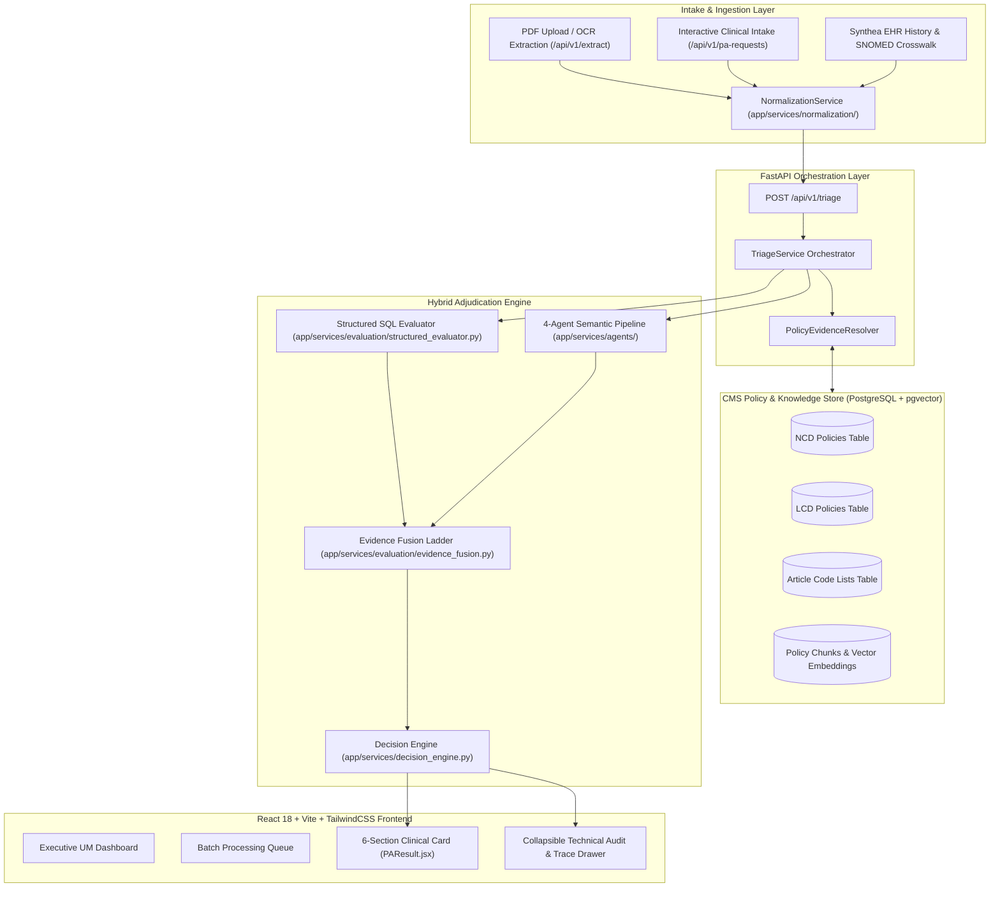
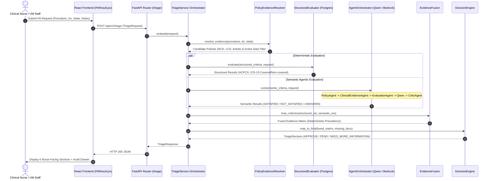

# Prior Authorization Triage & Policy Companion
### CMS Medicare Policy Adjudication Engine & Clinical Decision Intelligence

> **CTS Hackathon | Use Case UC02 — Utilization Management & Policy Companion**

---

## 📌 1. Executive Summary

The **Prior Authorization Triage & Policy Companion** is an automated, explainable clinical decision-support and utilization management (UM) platform engineered for the **CTS Hackathon (Use Case UC02 — Utilization Management & Policy Companion)**.

The platform addresses one of the most resource-intensive bottlenecks in U.S. healthcare: **Prior Authorization (PA)** for Medicare services. It bridges the gap between complex, multi-layered statutory Medicare coverage policies and unstructured electronic health record (EHR) clinical notes. 

By unifying **deterministic SQL rule enforcement** against official CMS policy databases with an **agentic 4-stage LLM semantic evaluation pipeline** (powered by AWS Bedrock / Qwen) and a **strict Critic validation layer**, the platform delivers transparent, sub-second prior authorization triage. Decisions are surfaced through a nurse-centered clinical UI categorized strictly into three actionable dispositions: **`APPROVE`**, **`PEND`**, or **`NEED MORE INFORMATION`**.

---

## 🏥 2. The Problem & Healthcare Context

### Industry Challenges
* **Severe Turnaround Delays**: Manual prior authorization reviews typically take between **5 to 14 days**, delaying essential patient procedures and drug therapies.
* **Administrative Burnout**: Clinical nurses and UM specialists spend hours manually searching hundreds of pages of complex, overlapping CMS Medicare policies.
* **Fragmented Policy Hierarchy**: Medicare coverage is governed across multiple regulatory tiers:
  * **National Coverage Determinations (NCDs)**: CMS statutory rules applied across all 50 states.
  * **Medicare Administrative Contractors (MACs)**: Regional jurisdictions (e.g., Novitas Solutions Jurisdiction J5 covering TX, NM, OK, LA, CO, MS, AR).
  * **Local Coverage Determinations (LCDs)**: Contractor-specific clinical indications and reasonable/necessary criteria.
  * **Local Coverage Articles (Articles)**: Mandatory companion billing/coding tables defining covered and non-covered HCPCS/CPT and ICD-10-CM codes.
* **Inconsistent & Arbitrary Rejections**: Human fatigue or unguided AI evaluations frequently misclassify missing records as denials or hallucinate policy compliance.

---

## 🏛️ 3. Core Architectural Pillars

```
┌─────────────────────────────────────────────────────────────────────────────────────────────────┐
│                                    KEY ARCHITECTURAL PILLARS                                    │
├──────────────────────────┬──────────────────────────┬───────────────────────────────────────────┤
│ 1. Deterministic SQL     │ 2. Agentic Semantic      │ 3. Evidence Fusion & Precedence           │
│    Authority             │    Critic Pipeline       │                                           │
│  - PostgreSQL + pgvector │  - PolicyAgent           │  - Strict Authority Truth Table           │
│  - Exact HCPCS / ICD-10  │  - ClinicalEvidenceAgent │  - Deterministic Exclusions Override LLM  │
│  - Contractor State J5   │  - EvaluationAgent       │  - Hallucination / Contradiction Guard    │
│  - Effective Date Check  │  - Qwen + CriticAgent    │  - Fused Evidence Matrix                  │
├──────────────────────────┴──────────────────────────┴───────────────────────────────────────────┤
│ 4. 3-Disposition Nurse Workflow (APPROVE / PEND / NEED MORE INFORMATION)                         │
│    Primary 6-Section Clinical Summary Card  +  Collapsible Technical Audit & Trace Drawer        │
├─────────────────────────────────────────────────────────────────────────────────────────────────┤
│ 5. Multi-Intake & EHR Normalization (PDF OCR/Extraction, Synthea SNOMED Crosswalk)              │
└─────────────────────────────────────────────────────────────────────────────────────────────────┘
```

---

## 🏗️ 4. End-to-End System Architecture



---

## 🔄 5. End-to-End Adjudication Lifecycle



---

## 📜 6. CMS Statutory Policy Hierarchy

The platform strictly navigates Medicare's statutory hierarchy:

```
                            ┌────────────────────────────────────────────────────────┐
                            │         National Coverage Determination (NCD)          │
                            │  - Established by CMS for all 50 US States             │
                            │  - Highest statutory authority                         │
                            └───────────────────────────┬────────────────────────────┘
                                                        │
                                                        ▼
                            ┌────────────────────────────────────────────────────────┐
                            │           Medicare Administrative Contractor           │
                            │                         (MAC)                          │
                            │  - Validates regional jurisdiction                     │
                            │  - e.g., Jurisdiction J5 (TX, NM, OK, LA, CO, MS, AR)  │
                            └───────────────────────────┬────────────────────────────┘
                                                        │
                                                        ▼
                            ┌────────────────────────────────────────────────────────┐
                            │          Local Coverage Determination (LCD)            │
                            │  - Contractor-specific clinical indications            │
                            │  - Reasonable & necessary criteria                     │
                            └───────────────────────────┬────────────────────────────┘
                                                        │
                                                        ▼
                            ┌────────────────────────────────────────────────────────┐
                            │            Local Coverage Article (Article)            │
                            │  - Companion coding article defining valid HCPCS/CPT   │
                            │    and ICD-10-CM covered and non-covered code tables   │
                            └────────────────────────────────────────────────────────┘
```

---

## ⚙️ 7. Detailed Component Breakdown

### 1. Multi-Channel Intake & Document Normalization
* **PDF Extraction Engine** (`app/api/v1/extract.py`): Parses uploaded clinical PDF documents using text stream extractors and regex pattern matchers to extract patient age, US state, procedure CPT/HCPCS, ICD-10 codes, and clinical documentation.
* **Normalization Layer** (`app/services/normalization/normalization_service.py`): Stateless transformation layer that standardizes state full-names to 2-letter postal codes, normalizes date formats to `YYYY-MM-DD`, strips whitespace, extracts uppercase alphanumeric ICD-10 diagnosis codes, and assigns unique `PA-XXXXXXXX` identifiers.
* **Synthea EHR Crosswalking** (`app/repositories/synthea_repository.py`): Synthesizes longitudinal patient records and converts SNOMED-CT clinical codes to standard ICD-10 and CPT codes.

### 2. Multi-Policy Evidence Resolver
* Implemented in `app/services/policy_evidence_resolver.py`.
* Queries relational tables to match procedure and diagnosis codes against NCD, MAC jurisdiction, LCD, and Article records.
* Filters out superseded or inactive policies using effective and termination date ranges (`effective_date` $\le \text{today} \le \text{end_date}$).

### 3. Structured Deterministic SQL Evaluator
* Implemented in `app/services/evaluation/structured_evaluator.py`.
* Evaluates exact code matches against `lcd_hcpcs_codes`, `article_icd10_covered`, and `article_icd10_noncovered`.
* Emits deterministic statuses:
  * `SATISFIED`: Procedure and diagnosis are covered under active policy tables.
  * `NOT_SATISFIED`: Procedure or diagnosis is explicitly excluded in non-covered lists.
  * `UNKNOWN`: Unlisted or unaddressed code.

### 4. 4-Stage Agentic Semantic & Critic Pipeline
* Implemented in `app/services/agents/agent_orchestrator.py` with AWS Bedrock / Qwen 2.5 72B.

```mermaid
flowchart LR
    P1["1. PolicyAgent"] -->|Required Evidence Schema| P2["2. ClinicalEvidenceAgent"]
    P2 -->|Extracted Evidence + Synonym Mapping| P3["3. EvaluationAgent"]
    P3 -->|Heuristic Sufficiency Context| P4["4. Qwen Bedrock LLM"]
    P4 -->|Candidate Decision & Citations| P5["5. CriticAgent"]
    P5 -->|Hallucination Audit & Contradiction Guard| OUT["Final Semantic Result"]
```



1. **`PolicyAgent`** (`policy_agent.py`): Deconstructs unstructured policy text into discrete clinical criteria, conservative therapy duration thresholds (e.g., 6–12 weeks), and diagnostic imaging requirements.
2. **`ClinicalEvidenceAgent`** (`clinical_evidence_agent.py`): Scans patient notes using an embedded clinical synonym dictionary (`_SYNONYM_MAP`) to extract supporting, contradicting, and missing evidence.
3. **`EvaluationAgent`** (`evaluation_agent.py`): Performs heuristic sufficiency checks before invoking the LLM.
4. **`LLM Client / Qwen`** (`app/services/llm/client.py`): Evaluates medical necessity and extracts verbatim sentence citations from patient records.
5. **`CriticAgent`** (`critic_agent.py`): **Hallucination & Absence Guardrail**. Audits candidate citations against raw clinical notes. If key phrases are missing or if information is simply absent rather than contradictory, it forces the status to `UNKNOWN` (preventing false denials).

### 5. Evidence Fusion Authority Ladder
* Implemented in `app/services/evaluation/evidence_fusion.py`.
* **Guarantees that probabilistic AI predictions can never override deterministic policy rules.**

| Structured SQL Status | Semantic Agent Status | Criterion Type | Fused Status | Authoritative Evaluator | Authority Rationale |
| :--- | :--- | :--- | :--- | :--- | :--- |
| `NOT_SATISFIED` | *Any Status* | `STRUCTURED` | **`NOT_SATISFIED`** | `EvaluatorType.SQL` | Hard code exclusion strictly overrides semantic claims |
| *Any Status* | `NOT_SATISFIED` | `SEMANTIC` | **`NOT_SATISFIED`** | `EvaluatorType.AGENTIC_QWEN` | Explicit clinical contraindication documented |
| `SATISFIED` | `SATISFIED` | `STRUCTURED` | **`SATISFIED`** | `EvaluatorType.SQL` | Both layers confirm validity |
| `SATISFIED` | `SATISFIED` | `SEMANTIC` | **`SATISFIED`** | `EvaluatorType.AGENTIC_QWEN` | Both layers confirm clinical criteria met |
| `SATISFIED` | `UNKNOWN` | `STRUCTURED` | **`SATISFIED`** | `EvaluatorType.SQL` | SQL code match is authoritative for code check |
| `SATISFIED` | `UNKNOWN` | `SEMANTIC` | **`UNKNOWN`** | `EvaluatorType.AGENTIC_QWEN` | Clinical requirement lacks submitted documentation |
| `UNKNOWN` | `SATISFIED` | `SEMANTIC` | **`SATISFIED`** | `EvaluatorType.AGENTIC_QWEN` | Clinical evidence established in notes |
| `UNKNOWN` | `UNKNOWN` | *Any* | **`UNKNOWN`** | `EvaluatorType.SQL` | Insufficient documentation across all layers |

---

## 👩‍⚕️ 8. Decision Engine & 3-Disposition Nurse Workflow

To eliminate adversarial denial friction, decisions are normalized into **three canonical dispositions**:

1. **`APPROVE`**: Covered procedure, eligible indication, and all mandatory clinical documentation (e.g., conservative therapy duration, MRI findings) are satisfied.
2. **`PEND`**: Service conflicts with a statutory exclusion or policy requirement, routing the case for review by a Nurse Adjudicator or Medical Director.
3. **`NEED MORE INFORMATION`**: Potentially covered, but essential documentation (e.g., physical therapy duration, imaging report) is missing.

### 6-Section Nurse Clinical Card & Technical Audit Drawer
```
┌────────────────────────────────────────────────────────────────────────────────────────────────┐
│  PRIOR AUTHORIZATION DECISION                                                                  │
├────────────────────────────────────────────────────────────────────────────────────────────────┤
│  1. FINAL DECISION          : [ APPROVE ]  /  [ PEND ]  /  [ NEED MORE INFORMATION ]           │
│  2. APPLICABLE POLICY       : LCD 36920 — Epidural Steroid Injections for Pain Management      │
│  3. POLICY REQUIREMENTS     : Procedure 64483 covered; M54.16 indication; ≥8 wks PT failure    │
│  4. CLINICAL EVIDENCE       : 8-week physical therapy failure; MRI confirms L5-S1 herniation   │
│  5. EVALUATION SUMMARY      : Medical necessity confirmed under Novitas J5 guidelines          │
│  6. INFORMATION NEEDED      : None (or specific checklist of missing documents)                │
└────────────────────────────────────────────────────────────────────────────────────────────────┘
│                                                                                                │
│  ▼ [ View Detailed Technical Logs & Audit Trail ] (Collapsible Secondary Drawer)              │
│    - Policy Hierarchy Path (NCD -> Contractor State J5 -> LCD 36920 -> Article 56681)          │
│    - Evidence Fusion Matrix (Structured SQL vs Semantic Agent comparison table)               │
│    - Deterministic Code & Jurisdiction Cards                                                   │
│    - Agentic Semantic Step-by-Step Visualization & Critic Audit Trace                          │
│    - Vector RAG Policy Passages with Cosine Similarity Scores                                  │
└────────────────────────────────────────────────────────────────────────────────────────────────┘
```

---

## 🧪 9. Validated Realistic Test Scenarios

The platform includes pre-seeded, end-to-end clinical test scenarios (`PA-REAL-001` through `007`):

| Scenario ID | Procedure & Diagnosis | Governing Policy | Disposition | Clinical Validation Focus |
| :--- | :--- | :--- | :--- | :--- |
| **`PA-REAL-001`** | `20610` (Knee Injection) + `M17.11` (Knee OA) | LCD 39529 / Article 56157 | **`APPROVE`** | 12-week PT trial failure, NSAID failure, radiographic Grade 2/3 confirmation |
| **`PA-REAL-002`** | `64483` (Epidural) + `M54.16` (Radiculopathy) | LCD 36920 / Article 56681 | **`APPROVE`** | 8-week PT trial failure, lumbar MRI nerve root compression |
| **`PA-REAL-003`** | `20552` (Trigger Point) + `M25.50` (Joint Pain) | LCD 36920 / Policy Exclusion | **`PEND`** | Acute joint pain without trigger points; conflicts with explicit policy exclusion |
| **`PA-REAL-004`** | `64483` (Epidural) + `R51.9` (Headache) | LCD 36920 | **`NEED MORE INFORMATION`** | Unlisted headache diagnosis; missing spinal physical exam and imaging reports |
| **`PA-REAL-005`** | `20552` (Trigger Point) + `M25.50` (Acupuncture) | NCD 373 | **`PEND`** | National coverage exclusion for non-indicated acupuncture indications |
| **`PA-REAL-006`** | `20610` (Knee Injection) + `Z00.00` (General Exam) | LCD 39529 / Article 56157 | **`NEED MORE INFORMATION`** | Administrative routine exam code; missing underlying joint pathology records |
| **`PA-REAL-007`** | `J1561` (IVIG Infusion) + `L10.0` (Pemphigus) | NCD 158 | **`APPROVE`** | Biopsy-proven pemphigus vulgaris refractory to systemic corticosteroids |

---

## 💻 10. Technology Stack & Project Structure

### Technology Stack
* **Backend**: FastAPI, Python 3.11+, SQLAlchemy 2.0, Pydantic v2, Pytest
* **Database**: PostgreSQL 15+ (Neon Serverless Postgres) + `pgvector` extension
* **AI & LLM Services**: AWS Bedrock (Qwen 2.5 72B / Claude 3.5 Sonnet / Llama 3), LM Studio local fallback
* **Document Extraction**: `pypdf`, `PyPDF2`, Regex Stream Parsers
* **Frontend**: React 18, Vite 5, TailwindCSS 3, Lucide React, Axios, React Router v6

### Repository Layout

```text
CTS-Hackathon/
├── Filtered_Data/                           # Authoritative CMS Medicare datasets (NCD, LCD, Articles, Codes)
├── demo_pdfs/                               # Sample clinical PA PDF intake documents
├── Frontend/                                # React 18 / Vite Single Page Application
│   ├── src/
│   │   ├── components/
│   │   │   ├── auth/                        # ProtectedRoute.jsx
│   │   │   ├── common/                      # DecisionBadge.jsx, StatCard.jsx
│   │   │   ├── pa/                          # ManualPAForm.jsx
│   │   │   └── result/                      # EvidenceFusionPanel.jsx, PolicyPathDisplay.jsx,
│   │   │                                    # AgentEvaluationPanel.jsx, RagEvidenceSection.jsx
│   │   ├── pages/                           # Dashboard.jsx, NewPARequest.jsx, BatchQueue.jsx,
│   │   │                                    # PAHistory.jsx, PAResult.jsx, Settings.jsx
│   │   ├── services/api.js                  # Axios client
│   │   └── App.jsx                          # Route definitions
│   └── package.json
│
├── prior-auth-api/                          # FastAPI Python Application
│   ├── app/
│   │   ├── api/v1/                          # triage.py, extract.py, pa_requests.py, policies.py, lcds.py, ncds.py
│   │   ├── core/                            # config.py, logging.py
│   │   ├── models/                          # SQLAlchemy ORM models (lcd.py, ncd.py, article.py)
│   │   ├── repositories/                    # postgres/ and mock/ repositories, synthea_repository.py
│   │   ├── schemas/                         # Pydantic models (triage.py, pa_request.py, evaluation.py)
│   │   └── services/
│   │       ├── agents/                      # agent_orchestrator.py, policy_agent.py,
│   │       │                                # clinical_evidence_agent.py, evaluation_agent.py, critic_agent.py
│   │       ├── evaluation/                  # multi_evaluator.py, structured_evaluator.py,
│   │       │                                # semantic_evaluator.py, evidence_fusion.py,
│   │       │                                # criterion_extractor.py, criterion_classifier.py
│   │       ├── llm/client.py                # AWS Bedrock / LM Studio client
│   │       ├── normalization/               # normalization_service.py
│   │       ├── pa_request/                  # pa_request_service.py
│   │       ├── decision_engine.py           # DecisionEngine authority mapping
│   │       ├── policy_evidence_resolver.py  # Cross-policy discovery
│   │       └── triage_service.py            # Primary triage orchestrator
│   ├── tests/                               # 122+ Pytest test suite
│   └── requirements.txt
├── PROJECT_DESCRIPTION.md                   # This detailed project description document
└── README.md                                # Root technical readme and execution guide
```

---

## 🔒 11. Security, Governance & Compliance

1. **Deterministic Authority Guardrails**: AI models are strictly restricted from overriding hard coding rules or statutory exclusions.
2. **Absence vs. Contradiction Protection**: Missing records automatically yield `NEED MORE INFORMATION` rather than improper clinical denials.
3. **Fail-Safe Fallbacks**: Network timeouts or parsing issues fail safely to `UNKNOWN`, escalating the case for manual nurse review.
4. **De-Identified Data Handling**: Direct patient PII is isolated from upstream LLM prompt payloads.
5. **Full Audit Traceability**: Every decision provides citations to the exact LCD/NCD policy clause and verbatim clinical note passages.

---

## 👥 12. License & Attribution

Developed for the **CTS Hackathon 2026** — *Prior Authorization Triage & Policy Companion (Use Case UC02)*.  
Released under the **MIT License**.
