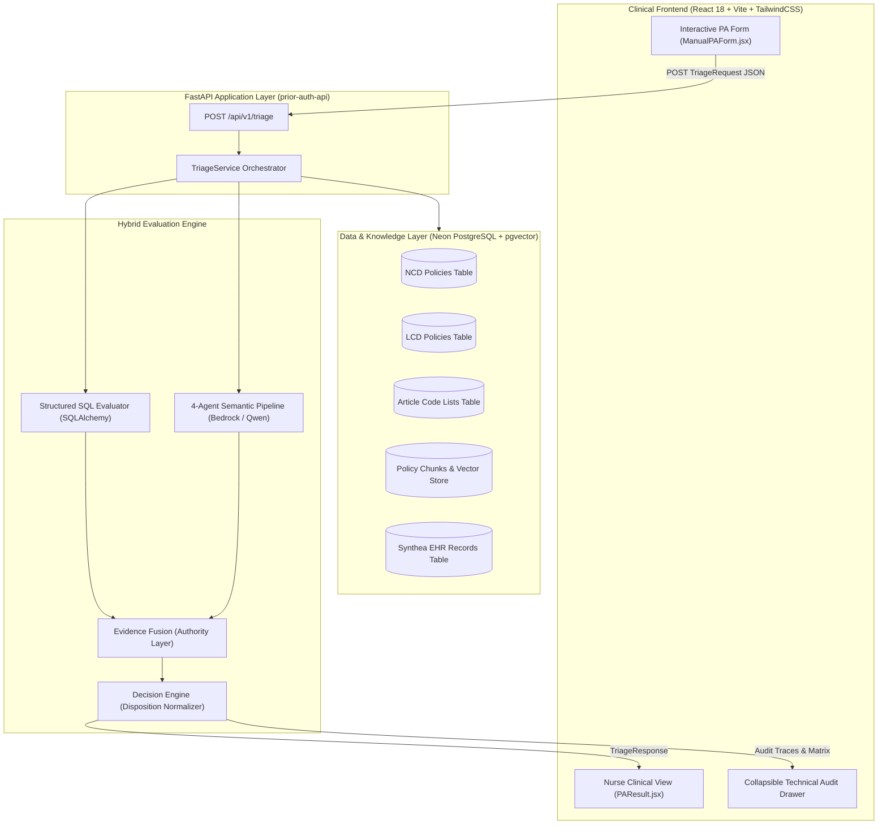
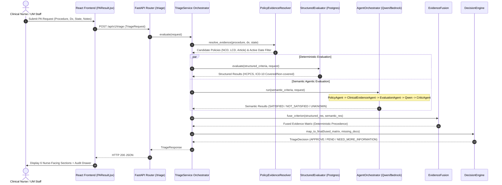

# Prior Authorization Triage & Policy Companion
### CMS Medicare Policy Adjudication Engine & Clinical Decision Intelligence

> **CTS Hackathon | Use Case UC02 — Utilization Management & Policy Companion**

An automated, explainable Prior Authorization (PA) triage intelligence platform combining **deterministic CMS Medicare coverage policy rules**, **PostgreSQL code repositories**, and an **agentic clinical evidence evaluation pipeline** powered by AWS Bedrock (Qwen / Claude / Llama) with strict critic validation and hallucination defense.

---

## 📋 Table of Contents
1. [Overview & Problem Statement](#-1-overview--problem-statement)
2. [Key Architectural Pillars](#-2-key-architectural-pillars)
3. [System Architecture](#-3-system-architecture)
4. [End-to-End Request Flow](#-4-end-to-end-request-flow)
5. [CMS Policy Hierarchy & Resolution Flow](#-5-cms-policy-hierarchy--resolution-flow)
6. [Hybrid Evaluation Pipeline](#-6-hybrid-evaluation-pipeline)
   - [Structured SQL Evaluator](#structured-sql-evaluator)
   - [Agentic Semantic & Critic Pipeline](#agentic-semantic--critic-pipeline)
   - [Evidence Fusion Authority Ladder](#evidence-fusion-authority-ladder)
7. [Decision Engine & 3-Disposition Nurse Workflow](#-7-decision-engine--3-disposition-nurse-workflow)
8. [Validated Realistic Scenarios (PA-REAL-001 – 007)](#-8-validated-realistic-scenarios-pa-real-001--007)
9. [Frontend Application & Clinical UI](#-9-frontend-application--clinical-ui)
10. [Database Architecture & Repositories](#-10-database-architecture--repositories)
11. [API Reference](#-11-api-reference)
12. [Project Structure & Source Traceability](#-12-project-structure--source-traceability)
13. [Security, Safety, & Error Handling](#-13-security-safety--error-handling)
14. [Quickstart & Verification](#-14-quickstart--verification)

---

## 🏥 1. Overview & Problem Statement

### The Healthcare Challenge
Prior Authorization is a utilization management process used by Medicare Administrative Contractors (MACs) and commercial health plans to determine if a prescribed service meets medical necessity and coverage guidelines before treatment. 

Evaluating PA requests manually requires navigating hundreds of pages of dense Medicare **National Coverage Determinations (NCDs)**, regional **Local Coverage Determinations (LCDs)**, and **Local Coverage Articles (Articles)**. Manual evaluation causes:
* **Severe Treatment Delays**: Average turnaround times of 5–14 days.
* **Administrative Burnout**: High clinical labor costs for nurses and utilization management (UM) staff.
* **Inconsistent & Arbitrary Denials**: Ambiguous policy interpretation and missing documentation leading to avoidable rejections.

### The Solution
This platform delivers an automated, explainable clinical decision-support engine that:
1. **Deterministically Evaluates Hard Medical Codes**: Verifies HCPCS/CPT procedure codes, ICD-10-CM diagnosis codes, contractor jurisdictions, and effective dates against authoritative CMS databases.
2. **Semantically Analyzes Clinical Records**: Employs a 4-agent sequential LLM pipeline to extract clinical evidence from physician notes, check conservative therapy durations, and audit diagnostic imaging reports.
3. **Guarantees Zero LLM Overrides on Policy Exclusions**: Employs an Evidence Fusion matrix where deterministic SQL exclusions take absolute precedence over probabilistic AI approvals.
4. **Delivers a Clean 3-Disposition Nurse Interface**: Presents concise, explainable results categorized strictly into **`APPROVE`**, **`PEND`**, or **`NEED MORE INFORMATION`**, completely eliminating negative denial labels from the nursing workflow.

---

## 🏛️ 2. Key Architectural Pillars

```
┌─────────────────────────────────────────────────────────────────────────────────────────────────┐
│                                    KEY ARCHITECTURAL PILLARS                                    │
├──────────────────────────┬──────────────────────────┬───────────────────────────────────────────┤
│ 1. Deterministic SQL     │ 2. Agentic Semantic      │ 3. Evidence Fusion & Precedence           │
│    Authority             │    Critic Pipeline       │                                           │
│  - PostgreSQL + pgvector │  - PolicyAgent           │  - Strict Authority Truth Table           │
│  - Exact HCPCS / ICD-10  │  - ClinicalEvidenceAgent │  - Deterministic Exclusions Override LLM  │
│  - Contractor State J5   │  - EvaluationAgent       │  - Hallucination / Contradiction Guard    │
│  - Effective Date Check  │  - Qwen + CriticAgent    │  - Fused Evidence Matrix                  │
├──────────────────────────┴──────────────────────────┴───────────────────────────────────────────┤
│ 4. 3-Disposition Nurse-Facing Presentation (APPROVE / PEND / NEED MORE INFORMATION)             │
│    Primary 6-Section Clinical Summary Card  +  Collapsible Technical Audit & Trace Drawer        │
└─────────────────────────────────────────────────────────────────────────────────────────────────┘
```

---

## 🏗️ 3. System Architecture



---

## 🔄 4. End-to-End Request Flow



---

## 📜 5. CMS Policy Hierarchy & Resolution Flow

The platform enforces the statutory Medicare Coverage hierarchy:

```
                            ┌────────────────────────────────────────────────────────┐
                            │         National Coverage Determination (NCD)          │
                            │  - Established by CMS for all 50 US States             │
                            │  - Highest statutory authority                         │
                            └───────────────────────────┬────────────────────────────┘
                                                        │
                                                        ▼
                            ┌────────────────────────────────────────────────────────┐
                            │           Medicare Administrative Contractor           │
                            │                         (MAC)                          │
                            │  - Validates regional jurisdiction                     │
                            │  - e.g., Jurisdiction J5 (TX, NM, OK, LA, CO, MS, AR)  │
                            └───────────────────────────┬────────────────────────────┘
                                                        │
                                                        ▼
                            ┌────────────────────────────────────────────────────────┐
                            │          Local Coverage Determination (LCD)            │
                            │  - Contractor-specific clinical indications            │
                            │  - Reasonable & necessary criteria                     │
                            └───────────────────────────┬────────────────────────────┘
                                                        │
                                                        ▼
                            ┌────────────────────────────────────────────────────────┐
                            │            Local Coverage Article (Article)            │
                            │  - Companion coding article defining valid HCPCS/CPT   │
                            │    and ICD-10-CM covered and non-covered code tables   │
                            └────────────────────────────────────────────────────────┘
```

---

## ⚙️ 6. Hybrid Evaluation Pipeline

### Structured SQL Evaluator
* **Source**: `app/services/evaluation/structured_evaluator.py`
* **Function**: Executes deterministic relational queries against `lcd_hcpcs_codes`, `article_icd10_covered`, `article_icd10_noncovered`, and `ncd_hcpcs_codes`.
* **Behavior**:
  - Covered procedure code + covered diagnosis code $\rightarrow$ `EvaluationStatus.SATISFIED`
  - Explicitly excluded procedure or diagnosis $\rightarrow$ `EvaluationStatus.NOT_SATISFIED`
  - Unlisted code not present in policy tables $\rightarrow$ `EvaluationStatus.UNKNOWN`

### Agentic Semantic & Critic Pipeline
* **Source**: `app/services/agents/agent_orchestrator.py`
* **Architecture**: A sequential 4-agent pipeline with strict safety invariants:

```mermaid
flowchart LR
    P1["1. PolicyAgent"] -->|Required Evidence| P2["2. ClinicalEvidenceAgent"]
    P2 -->|Evidence Matrix & Synonyms| P3["3. EvaluationAgent"]
    P3 -->|Structured Context| P4["4. Qwen (Bedrock LLM)"]
    P4 -->|Candidate Citation| P5["5. CriticAgent"]
    P5 -->|Validated Result| OUT["Final Semantic Result"]
```



1. **`PolicyAgent`** (`policy_agent.py`): Decomposes policy text into expected positive clinical indicators, negative exclusion flags, and minimum threshold requirements.
2. **`ClinicalEvidenceAgent`** (`clinical_evidence_agent.py`): Scans patient notes using an embedded healthcare synonym dictionary (`_SYNONYM_MAP`), extracting `supporting_evidence`, `contradicting_evidence`, and `missing_evidence`.
3. **`EvaluationAgent`** (`evaluation_agent.py`): Performs heuristic sufficiency checks before LLM execution.
4. **`LLMClient / Qwen`** (`app/services/llm/client.py`): Evaluates evidence against requirements and cites exact phrases from the clinical record.
5. **`CriticAgent`** (`critic_agent.py`): Audits LLM citations against raw clinical notes. If key phrases do not match or if documentation is merely absent (rather than explicitly contradictory), the critic overrides the result to `UNKNOWN`, guarding against false denials.

### Evidence Fusion Authority Ladder
* **Source**: `app/services/evaluation/evidence_fusion.py`
* **Truth Table**:

| Structured SQL Status | Semantic Agent Status | Criterion Type | Fused Status | Authoritative Evaluator | Authority Rationale |
| :--- | :--- | :--- | :--- | :--- | :--- |
| `NOT_SATISFIED` | *Any Status* | `STRUCTURED` | **`NOT_SATISFIED`** | `EvaluatorType.SQL` | Deterministic code exclusion strictly overrides semantic claims |
| *Any Status* | `NOT_SATISFIED` | `SEMANTIC` | **`NOT_SATISFIED`** | `EvaluatorType.AGENTIC_QWEN` | Verified explicit clinical contradiction in medical record |
| `SATISFIED` | `SATISFIED` | `STRUCTURED` | **`SATISFIED`** | `EvaluatorType.SQL` | Both evaluators confirm procedural/diagnostic validity |
| `SATISFIED` | `SATISFIED` | `SEMANTIC` | **`SATISFIED`** | `EvaluatorType.AGENTIC_QWEN` | Both evaluators confirm clinical criteria met |
| `SATISFIED` | `UNKNOWN` | `STRUCTURED` | **`SATISFIED`** | `EvaluatorType.SQL` | SQL code match is authoritative for code checks |
| `SATISFIED` | `UNKNOWN` | `SEMANTIC` | **`UNKNOWN`** | `EvaluatorType.AGENTIC_QWEN` | Clinical requirement lacks submitted documentation |
| `UNKNOWN` | `SATISFIED` | `SEMANTIC` | **`SATISFIED`** | `EvaluatorType.AGENTIC_QWEN` | Clinical evidence established in notes |
| `UNKNOWN` | `UNKNOWN` | *Any* | **`UNKNOWN`** | `EvaluatorType.SQL` | Insufficient information across all layers |

---

## 👩‍⚕️ 7. Decision Engine & 3-Disposition Nurse Workflow

Implemented in `app/services/decision_engine.py` and `Frontend/src/pages/PAResult.jsx`.

### The 3 Canonical Dispositions
1. **`APPROVE`**: The requested procedure is covered under an active policy, the diagnosis is an eligible indication, and all mandatory clinical documentation criteria are satisfied.
2. **`PEND`**: The requested service conflicts with an applicable policy exclusion, policy conflict, or mandatory criteria requiring human clinical adjudication by a nurse or Medical Director.
3. **`NEED MORE INFORMATION`**: The request is potentially eligible for coverage, but required clinical notes, imaging reports, or diagnostic confirmations are missing.

```
┌────────────────────────────────────────────────────────────────────────────────────────────────┐
│  PRIOR AUTHORIZATION DECISION                                                                  │
├────────────────────────────────────────────────────────────────────────────────────────────────┤
│  1. FINAL DECISION                                                                             │
│     [ APPROVE ]  /  [ PEND ]  /  [ NEED MORE INFORMATION ]                                     │
│                                                                                                │
│  2. APPLICABLE POLICY                                                                          │
│     LCD 36920 — Epidural Steroid Injections for Pain Management                                │
│                                                                                                │
│  3. POLICY REQUIREMENTS                                                                        │
│     ✓ Procedure 64483 is covered under the applicable policy.                                  │
│     ✓ Diagnosis M54.16 is an eligible indication.                                              │
│     ✓ Inadequate response to conservative therapy documented for at least 8 weeks.             │
│                                                                                                │
│  4. CLINICAL EVIDENCE                                                                          │
│     • Submitted procedure: 64483.                                                              │
│     • Submitted diagnosis: M54.16.                                                             │
│     • Completed an 8-week physical therapy regimen, oral gabapentin, and NSAID therapy.        │
│     • Lumbar MRI demonstrates L5-S1 right paracentral disc herniation with nerve root comp... │
│                                                                                                │
│  5. EVALUATION                                                                                 │
│     The submitted documentation supports the applicable coverage requirements. The requested   │
│     service is supported by the documented diagnosis, clinical symptoms, imaging findings,    │
│     and inadequate response to conservative treatment.                                         │
│                                                                                                │
│  6. INFORMATION NEEDED                                                                         │
│     None                                                                                       │
└────────────────────────────────────────────────────────────────────────────────────────────────┘
│                                                                                                │
│  ▼ [ View Detailed Technical Logs & Audit Trail ] (Collapsible Secondary Drawer)              │
│    - Governing Policy Hierarchy Path (NCD -> Jurisdiction -> LCD -> Article)                   │
│    - Evidence Fusion Matrix (Structured SQL vs Semantic Agent Matrix)                          │
│    - Deterministic Code & Jurisdiction Evidence Cards                                          │
│    - Agentic Semantic Evaluation Visualization & Critic Verdicts                               │
│    - RAG Policy Passage References with Cosine Similarity Scores                               │
└────────────────────────────────────────────────────────────────────────────────────────────────┘
```

---

## 🧪 8. Validated Realistic Scenarios (PA-REAL-001 – 007)

| Scenario ID | Procedure & Diagnosis | Governing Policy | Disposition | Clinical Validation Focus |
| :--- | :--- | :--- | :--- | :--- |
| **`PA-REAL-001`** | `20610` (Knee Injection) + `M17.11` (Knee OA) | LCD 39529 / Article 56157 | **`APPROVE`** | 12-week PT failure, oral NSAIDs failure, radiographic Grade 2/3 confirmation |
| **`PA-REAL-002`** | `64483` (Epidural) + `M54.16` (Radiculopathy) | LCD 36920 / Article 56681 | **`APPROVE`** | 8-week PT trial failure, MRI lumbar disc herniation with nerve root compression |
| **`PA-REAL-003`** | `20552` (Trigger Point) + `M25.50` (Joint Pain) | LCD 36920 / Policy Exclusion | **`PEND`** | Acute joint pain without trigger points; conflicts with policy exclusion |
| **`PA-REAL-004`** | `64483` (Epidural) + `R51.9` (Headache) | LCD 36920 | **`NEED MORE INFORMATION`** | Unlisted headache diagnosis; missing spinal physical exam and imaging |
| **`PA-REAL-005`** | `20552` (Trigger Point) + `M25.50` (Acupuncture) | NCD 373 | **`PEND`** | Explicit national exclusion for non-indicated acupuncture indications |
| **`PA-REAL-006`** | `20610` (Knee Injection) + `Z00.00` (General Exam) | LCD 39529 / Article 56157 | **`NEED MORE INFORMATION`** | Administrative routine exam code; missing joint pathology documentation |
| **`PA-REAL-007`** | `J1561` (IVIG Infusion) + `L10.0` (Pemphigus) | NCD 158 | **`APPROVE`** | Biopsy-proven pemphigus vulgaris refractory to systemic corticosteroids |

---

## 💻 9. Frontend Application & Clinical UI

Built with **React 18**, **Vite 5**, and **TailwindCSS 3**.

* **`Frontend/src/pages/Dashboard.jsx`**: Overview metrics (Total Requests, Approved, Pended for Review, Need More Information) and live backend health status indicator.
* **`Frontend/src/pages/NewPARequest.jsx`**: Fast intake interface with toggleable Manual PA Form and 1-click execution of pre-seeded realistic test scenarios (`PA-REAL-001` through `007`).
* **`Frontend/src/pages/PAHistory.jsx`**: Searchable and filterable case history table supporting status filters (`APPROVE`, `PEND`, `NEED MORE INFORMATION`).
* **`Frontend/src/pages/PAResult.jsx`**: The primary clinical summary view featuring the 6 nurse sections and the collapsible technical audit drawer.
* **`Frontend/src/pages/PolicyExplorer.jsx`**: Interactive CMS coverage policy search and article viewer.

---

## 🗄️ 10. Database Architecture & Repositories

* **Database Engine**: PostgreSQL 15+ (tested on Neon Serverless Postgres) with the `pgvector` extension.
* **ORM**: SQLAlchemy 2.0.
* **Repository Architecture**: Abstract interfaces (`app/repositories/interfaces/`) with production PostgreSQL implementations (`app/repositories/postgres/`) and in-memory mock repositories (`app/repositories/mock/`) toggled via `USE_MOCK_REPOSITORIES`.

### Key Relational Entities
```
┌─────────────────────────┐       ┌─────────────────────────┐       ┌─────────────────────────┐
│          lcds           │       │        articles         │       │          ncds           │
├─────────────────────────┤       ├─────────────────────────┤       ├─────────────────────────┤
│ lcd_id (PK)             │       │ article_id (PK)         │       │ ncd_id (PK)             │
│ lcd_version (PK)        │       │ article_version (PK)    │       │ ncd_version (PK)        │
│ title                   │       │ title                   │       │ title                   │
│ effective_date          │       │ effective_date          │       │ decision                │
│ end_date                │       │ end_date                │       │ effective_date          │
└────────────┬────────────┘       └────────────┬────────────┘       └────────────┬────────────┘
             │                                 │                                 │
             ▼                                 ▼                                 ▼
┌─────────────────────────┐       ┌─────────────────────────┐       ┌─────────────────────────┐
│     lcd_hcpcs_codes     │       │   article_hcpcs_codes   │       │     ncd_hcpcs_codes     │
│   lcd_icd10_covered     │       │  article_icd10_covered  │       │  lcd_ncd_associations   │
│  lcd_icd10_noncovered   │       │ article_icd10_noncovered│       │      policy_chunks      │
└─────────────────────────┘       └─────────────────────────┘       └─────────────────────────┘
```

---

## 🔌 11. API Reference

### Core Endpoints

#### `POST /api/v1/triage`
Submits a Prior Authorization request for policy evaluation.

**Request Body (`TriageRequest`)**:
```json
{
  "procedure_code": "64483",
  "diagnosis_codes": ["M54.16"],
  "state": "TX",
  "patient_age": 47,
  "clinical_notes": "Epidural injection, lumbar or sacral. Patient presents with lumbar radiculopathy confirmed on MRI. Conservative physical therapy was tried for 8 weeks without adequate relief."
}
```

**Response Body (`TriageResponse`)**:
```json
{
  "decision": "APPROVE",
  "evidence_score": 1.0,
  "reason": "All applicable policy criteria were satisfied. The submitted procedure and diagnosis codes meet coverage criteria under LCD 36920 / Article 56681.",
  "reason_codes": ["COVERED_BY_LCD", "CLINICAL_CRITERIA_SATISFIED"],
  "policies": [
    {
      "policy_type": "LCD",
      "policy_id": "36920",
      "title": "Epidural Steroid Injections for Pain Management",
      "article_id": "56681"
    }
  ],
  "policy_path": {
    "ncd": { "policy_id": null, "result": "NOT_ADDRESSED" },
    "jurisdiction": { "state": "TX", "result": "COVERED" },
    "lcd": { "policy_id": "36920", "result": "COVERED" },
    "article": { "policy_id": "56681", "result": "COVERED" }
  },
  "criteria": [
    {
      "criterion_id": "LCD-36920-HCPCS-64483",
      "policy_type": "LCD",
      "policy_id": "36920",
      "criterion": "The requested procedure must be an applicable service under LCD 36920.",
      "criterion_type": "STRUCTURED",
      "evaluator": "SQL",
      "status": "SATISFIED",
      "patient_evidence": ["Submitted HCPCS: 64483"],
      "policy_evidence": ["LCD 36920 contains HCPCS 64483 in its covered-procedure list."],
      "mandatory": true
    }
  ],
  "missing_information": [],
  "warnings": []
}
```

#### Additional Endpoints
* `GET /api/v1/policies/search?procedure_code=64483&diagnosis_code=M54.16&state=TX` — Cross-policy lookup.
* `GET /api/v1/lcds/{id}` — Get specific Local Coverage Determination details.
* `GET /api/v1/ncds/{id}` — Get specific National Coverage Determination details.
* `GET /api/v1/articles/{id}` — Get specific CMS Local Coverage Article details.
* `GET /api/v1/health` — Backend and database connectivity status.

---

## 📁 12. Project Structure & Source Traceability

```text
CTS-Hackathon/
├── Frontend/                                # React 18 / Vite Single Page Application
│   ├── src/
│   │   ├── components/
│   │   │   ├── common/                      # DecisionBadge.jsx, StatCard.jsx
│   │   │   ├── pa/                          # ManualPAForm.jsx
│   │   │   └── result/                      # EvidenceFusionPanel.jsx, PolicyPathDisplay.jsx,
│   │   │                                    # AgentEvaluationPanel.jsx, RagEvidenceSection.jsx
│   │   ├── pages/                           # Dashboard.jsx, NewPARequest.jsx, PAHistory.jsx,
│   │   │                                    # PAResult.jsx, PolicyExplorer.jsx, Settings.jsx
│   │   ├── services/api.js                  # Axios client
│   │   └── App.jsx                          # Route definitions
│   └── package.json
│
├── prior-auth-api/                          # FastAPI Python Application
│   ├── app/
│   │   ├── api/v1/                          # triage.py, policies.py, lcds.py, ncds.py, articles.py
│   │   ├── core/                            # config.py, logging.py
│   │   ├── models/                          # SQLAlchemy ORM models (lcd.py, ncd.py, article.py)
│   │   ├── repositories/                    # postgres/ and mock/ repositories
│   │   ├── schemas/                         # Pydantic models (triage.py, evaluation.py)
│   │   └── services/
│   │       ├── agents/                      # agent_orchestrator.py, policy_agent.py,
│   │       │                                # clinical_evidence_agent.py, evaluation_agent.py, critic_agent.py
│   │       ├── evaluation/                  # multi_evaluator.py, structured_evaluator.py,
│   │       │                                # semantic_evaluator.py, evidence_fusion.py,
│   │       │                                # criterion_extractor.py, criterion_classifier.py
│   │       ├── llm/client.py                # AWS Bedrock / LM Studio client
│   │       ├── decision_engine.py           # DecisionEngine authority mapping
│   │       ├── policy_evidence_resolver.py  # Cross-policy discovery
│   │       └── triage_service.py            # Primary triage orchestrator
│   ├── tests/
│   │   ├── test_semantic_and_fusion_pipeline.py # 10 Regression Tests + 5 Disposition Tests
│   │   ├── test_triage_engine.py            # TC01 - TC46 Comprehensive Tests
│   │   └── test_domain_routers.py           # API Router Tests
│   └── requirements.txt
└── README.md
```

### Source Traceability Matrix

| Architectural Layer | File Path | Primary Class / Function | Responsibility |
| :--- | :--- | :--- | :--- |
| **API Entry Point** | `prior-auth-api/app/main.py` | `app` | FastAPI setup, middleware, router mount |
| **Triage Controller** | `prior-auth-api/app/api/v1/triage.py` | `run_triage()` | Exposes `/api/v1/triage` POST endpoint |
| **Triage Orchestrator** | `prior-auth-api/app/services/triage_service.py` | `TriageService.evaluate()` | Full evaluation lifecycle orchestration |
| **Policy Evidence Resolver** | `prior-auth-api/app/services/policy_evidence_resolver.py` | `PolicyEvidenceResolver.resolve_evidence()` | Multi-policy discovery across NCD/LCD/Articles |
| **Structured Evaluator** | `prior-auth-api/app/services/evaluation/structured_evaluator.py` | `StructuredEvaluator.evaluate()` | Deterministic SQL code matching |
| **Criterion Extractor** | `prior-auth-api/app/services/evaluation/criterion_extractor.py` | `CriterionExtractor.extract_from_chunk()` | Policy chunk text decomposition |
| **Criterion Classifier** | `prior-auth-api/app/services/evaluation/criterion_classifier.py` | `CriterionClassifier.classify()` | Mandatory vs informational classification |
| **Semantic Evaluator** | `prior-auth-api/app/services/evaluation/semantic_evaluator.py` | `SemanticEvaluator.evaluate()` | Semantic criterion coordination |
| **Agent Orchestrator** | `prior-auth-api/app/services/agents/agent_orchestrator.py` | `AgentOrchestrator.run()` | 4-Agent sequential pipeline controller |
| **Policy Agent** | `prior-auth-api/app/services/agents/policy_agent.py` | `PolicyAgent.run()` | Expected clinical indicator extraction |
| **Clinical Evidence Agent** | `prior-auth-api/app/services/agents/clinical_evidence_agent.py` | `ClinicalEvidenceAgent.run()` | Medical record extraction & synonym parsing |
| **Evaluation Agent** | `prior-auth-api/app/services/agents/evaluation_agent.py` | `EvaluationAgent.run()` | Pre-LLM clinical sufficiency evaluation |
| **Critic Agent** | `prior-auth-api/app/services/agents/critic_agent.py` | `CriticAgent.run()` | Hallucination auditing & contradiction checking |
| **LLM Client** | `prior-auth-api/app/services/llm/client.py` | `LLMClient` | AWS Bedrock / LM Studio client integration |
| **Evidence Fusion** | `prior-auth-api/app/services/evaluation/evidence_fusion.py` | `EvidenceFusion.fuse_criterion()` | Deterministic authority ladder enforcement |
| **Decision Engine** | `prior-auth-api/app/services/decision_engine.py` | `DecisionEngine.map_to_final()` | Mapping fused matrix to 3 final dispositions |
| **Postgres Policy Repo** | `prior-auth-api/app/repositories/postgres/policy_repository.py` | `PostgresPolicyRepository` | Jurisdiction and effective date SQL queries |
| **Frontend Clinical View** | `Frontend/src/pages/PAResult.jsx` | `PAResult()` | Nurse-facing 6-section card & audit drawer |
| **Frontend Manual Form** | `Frontend/src/components/pa/ManualPAForm.jsx` | `ManualPAForm()` | Interactive PA submission with pre-seeded scenarios |

---

## 🔒 13. Security, Safety, & Error Handling

1. **Deterministic Authority Guardrails**: Probabilistic AI models cannot override SQL exclusions. If an HCPCS or ICD-10 code is explicitly non-covered in PostgreSQL, the request maps to `PEND` regardless of LLM assertions.
2. **Absence vs. Contradiction Protection**: Missing documentation is routed to `NEED MORE INFORMATION` rather than producing false clinical rejections.
3. **Fail-Safe Invariants**: Any network timeout, rate limit, or model parse failure defaults safely to `UNKNOWN`, triggering a request for manual review.
4. **PHI/PII Protection**: Direct patient identifiers are decoupled from policy lookup payloads.
5. **Secure Configuration**: AWS credentials and database connection strings are loaded exclusively via environment variables (`app/core/config.py`).

---

## 🚀 14. Quickstart & Verification

### Prerequisites
* Python 3.11+
* Node.js 18+ & npm
* PostgreSQL 15+ (Optional; mock repositories enabled by default)

### 1. Backend Setup & Startup
```bash
cd prior-auth-api

# Create and activate virtual environment
python -m venv .venv
.venv\Scripts\activate      # Windows PowerShell / CMD
# source .venv/bin/activate  # macOS / Linux

# Install dependencies
pip install -r requirements.txt

# Start backend FastAPI server on port 8000
uvicorn app.main:app --reload --port 8000
```
* Interactive Swagger Docs: `http://127.0.0.1:8000/docs`

### 2. Frontend Setup & Startup
```bash
cd ../Frontend

# Install dependencies
npm install

# Start Vite dev server on port 5173
npm run dev
```
* Clinical UI Application: `http://localhost:5173`

### 3. Running Automated Tests
```bash
cd prior-auth-api

# Execute full Pytest suite (122 tests)
.venv\Scripts\python -m pytest tests/ -v
```
All **122 automated tests** execute and pass in ~6 seconds:
```text
======================= 122 passed, 1 skipped in 6.32s ========================
```

---

## 👥 Contributors & License
Developed for the **CTS Hackathon 2026** — *Prior Authorization Triage & Policy Companion*.  
Released under the **MIT License**.