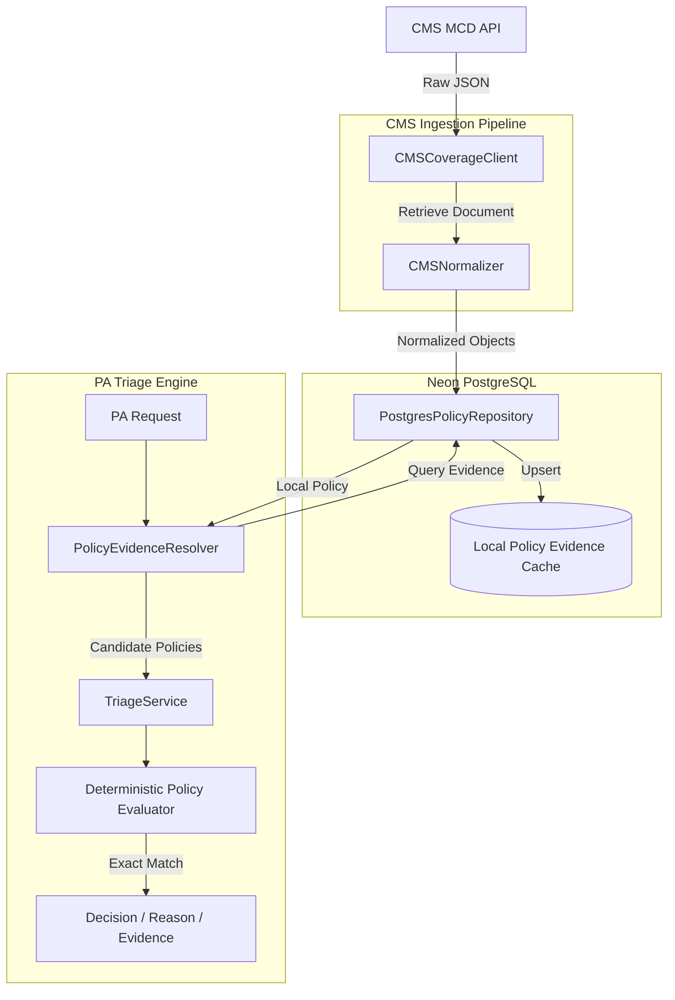
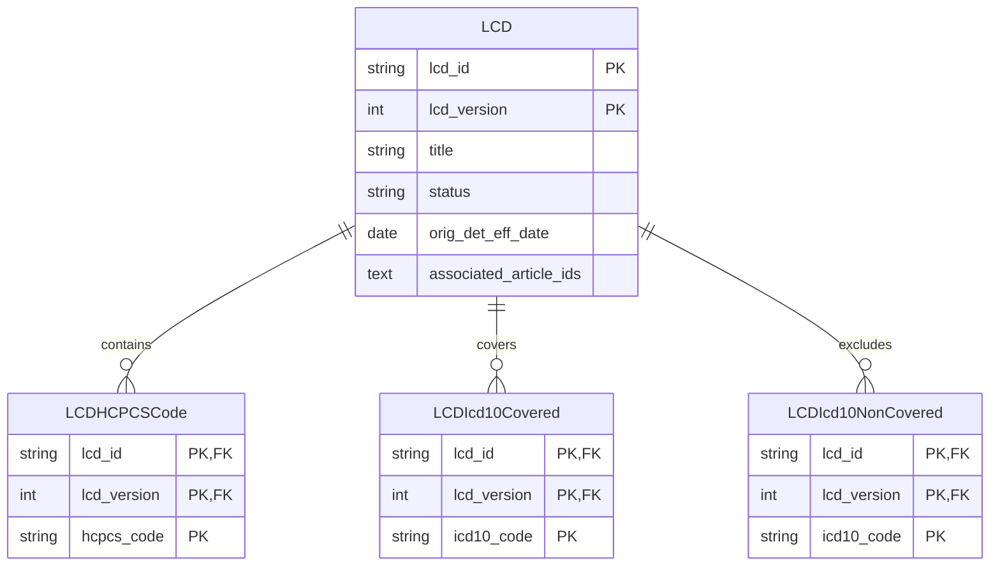

# AI-Powered Prior Authorization Triage & Policy Companion

> **CTS Hackathon | Use Case UC02 — Utilization Management**

An explainable Prior Authorization (PA) triage system that combines clinical request normalization, CMS Medicare coverage evidence, deterministic policy evaluation, and safe routing for manual review. This system acts as a deterministic policy companion to intelligently route PA requests using **deterministic SQL lookups**, **pgvector RAG vector search**, and **local LLM semantic criterion evaluation**.

---

## 📋 1. Problem Statement & Solution

### The Challenge
Prior Authorization (PA) is a utilization management process used by health insurers to determine if a prescribed procedure or service is medically necessary and covered. Evaluating PA requests requires reviewing complex clinical notes and diagnosis codes against lengthy, dense coverage policies (like Medicare's Local Coverage Determinations). Manual review is notoriously slow, leading to care delays, administrative burnout, and friction between providers and payers. Missing or incorrectly formatted information creates unnecessary denials. A system is needed to traceably connect patient clinical data to specific policy evidence to accelerate review and eliminate arbitrary denials.

### The Solution
This project provides an automated, explainable triage and decision-support system. 
1. **Receive PA request:** Accept standard clinical data and notes.
2. **Extract & Normalize:** Standardize HCPCS and ICD-10 formats.
3. **Query Evidence:** Check for normalized CMS policy evidence stored locally, fetching from CMS directly if missing.
4. **Evaluate Criteria:** Compare requested codes against structured policy lists, utilizing a 6-tier hierarchical adjudication cascade.
5. **Produce Recommendation:** Suggest `APPROVE`, `PEND`, or `REQUEST_MORE_INFORMATION`.
6. **Explain Reasoning:** Surface human-readable explanations mapping exactly to CMS policy requirements.

---

## ⚡ 2. Quick Start & Setup

The backend is built with **FastAPI**, **PostgreSQL (Neon)**, **SQLAlchemy**, and **pgvector**.

Navigate to the `prior-auth-api` directory to run the unified CLI (`manage.py`):

```bash
cd prior-auth-api

# Create & activate environment
python -m venv .venv
.venv\Scripts\activate      # Windows
source .venv/bin/activate  # macOS/Linux

# Install dependencies
pip install -r requirements.txt

# Start FastAPI dev server (port 8001)
python manage.py serve

# Run Pytest suite
python manage.py test

# Run Live API verification test suite (End to End)
python manage.py test-live
```

---

## 🏛️ 3. System Architecture



---

## ⚙️ 4. CMS Adjudication Engine

Our engine mirrors the official CMS adjudication hierarchy, enforced by a **deterministic + RAG + LLM cascade**:

1. **National Coverage (NCD) (Highest Priority):** Evaluates national policies via pgvector RAG and LLM criterion classifier. If an NCD explicitly covers or excludes the procedure, adjudication halts early.
2. **Jurisdiction Verification:** Validates state abbreviations against regional Medicare Administrative Contractor (MAC) jurisdictions.
3. **Local Coverage (LCD):** RAG search over active Local Coverage Determinations.
4. **Article ICD-10 Matrix:** Deterministic SQL validation against `article_icd10_covered` and `article_icd10_noncovered` code lists.

### Authority Hierarchy in Evidence Fusion
$$\text{Structured (SQL)} > \text{Rule-based} > \text{Semantic (LLM)}$$
Authoritative SQL code checks **always** override LLM outputs. Ambiguous LLM evaluations fall through to deterministic rules.

---

## 🔄 5. CMS API Integration & Fallback

We implemented a robust HTTP client specifically for the CMS Medicare Coverage Database (MCD) API to fetch live policy data:
- **Dynamic Authentication:** Automatically negotiates and injects the AMA/ADA license agreement `Bearer` token.
- **Local-First, CMS-Fallback:** Queries the local Neon PostgreSQL database first. If data is missing or incomplete, it reaches out to the CMS API, normalizes the massive JSON payload into our `PolicyMatch` Pydantic models, and caches it locally via an `upsert` mechanism for future requests.

---

## 🗄️ 6. Database Schema

Backed by **Neon PostgreSQL** and **pgvector**.



---

## 📡 7. API Endpoints & Payloads

- **Swagger UI**: http://localhost:8001/docs
- **ReDoc**: http://localhost:8001/redoc

### Triage Request (`POST /api/v1/triage`)
```json
{
  "procedure_code": "64483",
  "diagnosis_codes": ["M54.16"],
  "state": "TX",
  "patient_age": 65,
  "clinical_notes": "Patient has radiculopathy confirmed on MRI, failed conservative therapy."
}
```

### Triage Response (`200 OK`)
| Decision | Meaning |
| :--- | :--- |
| **APPROVE** | Policy evidence and configured criteria explicitly support approval. |
| **PEND** | Evidence is ambiguous, exclusions were triggered, or review requirements mandate a manual review. |
| **REQUEST_MORE_INFORMATION** | A required code is missing, or the diagnosis is not found in the policy code lists. |

---

## 🚀 8. Roadmap & Future Work

| Component | Status | Description & Solution |
|---|---|---|
| **Fact Extraction** | ✅ **Complete** | Standardized Pydantic request schema (`TriageRequest`). |
| **Coverage Cascade** | ✅ **Complete** | Full 6-phase adjudication pipeline (NCD → Jurisdiction → LCD → Article). |
| **Synthea History Retrieval** | ✅ **Complete** | Dynamically intercepts PA requests to fetch synthetic medical timelines. |
| **Synthea FHIR Ingestion** | ⚠️ **Partial (85%)** | Accepts free-text notes; native FHIR R4 Bundle parsing planned. |
| **Prior Claims History** | ❌ **Roadmap** | Longitudinal prior claims tracking planned for frequency/quantity limits. |
| **Decision Logging DB** | ❌ **Roadmap** | Immutable background audit logger (`triage_audit_logs`) for HIPAA compliance. |
| **HITL Nurse Review** | ❌ **Roadmap** | Review queue endpoints for UM nurses to adjudicate `PEND` requests. |
| **Background Sync Module** | ❌ **Roadmap** | A background worker to periodically query CMS APIs to pre-warm the database and delta-sync policy updates. |