# End-to-End Prior Authorization Execution Pipeline: Step-by-Step Architecture & Log Flow

This document provides a comprehensive, line-by-line and component-by-component explanation of the Prior Authorization adjudication pipeline, matching the execution log from the initial incoming request to the final clinical coverage decision.

---

## 🗺️ 1. High-Level Pipeline Architecture Diagram

```mermaid
flowchart TD
    subgraph INTAKE["1. Intake & Enrichment"]
        A["Incoming PA Request\n(PA-OPT-001)"] --> B["NormalizationService\n• State: TX\n• HCPCS: 20610\n• ICD-10: M17.11"]
        B --> C["SyntheaRepository\n• Fetch Longitudinal EHR History\n• Crosswalk SNOMED ➔ ICD10/CPT"]
        C --> D["TriageRequest Payload\n(Structured Codes + Enriched Notes)"]
    end

    subgraph POLICY["2. Policy Resolution (SQL & Hierarchy)"]
        D --> E["PolicyEvidenceResolver\n• SQL Lookup on HCPCS: 20610\n• Join LCD, NCD, and Jurisdiction tables"]
        E --> F["Found 3 Local Policies\n(e.g., LCD-39529 in TX Jurisdiction)"]
        F --> G["EmbeddingService\n• Model: sentence-transformers/all-MiniLM-L6-v2\n• 384-dim Query Vector"]
        G --> H["PolicyChunkRepository (pgvector)\n• Constrained Vector Search on LCD-39529 Chunks"]
    end

    subgraph EXTRACTION["3. Criteria Extraction & Classification"]
        H --> I["CriterionExtractor\n• Section-aware parsing & Regex\n• SHA-256 deterministic criterion IDs"]
        I --> J["CriterionClassifier\n• Check for HCPCS/ICD-10 codes ➔ STRUCTURED\n• Free-text clinical prerequisites ➔ SEMANTIC"]
    end

    subgraph EVALUATION["4. Hybrid Evaluation Layer"]
        subgraph STRUCTURED["Structured Evaluation (SQL)"]
            J -->|Code Criteria| K["StructuredEvaluator (SQL)\n• LCD-39529-HCPCS ➔ SATISFIED\n• LCD-39529-ICD10-M17.11 ➔ SATISFIED"]
        end

        subgraph AGENTIC["Agentic Semantic Pipeline (4 Agents + LLM)"]
            J -->|Semantic Criteria| L["AgentOrchestrator"]
            L --> M["1. PolicyAgent (LLM)\n• Decompose policy criterion\n• Extract Required Evidence (No patient notes)"]
            M --> N["2. ClinicalEvidenceAgent (Regex + LLM)\n• Scan patient notes & EHR\n• Medical synonym/acronym expansion\n• Injection & Hallucination check"]
            N --> O["3. EvaluationAgent (Deterministic)\n• Compare Policy vs Clinical Evidence\n• Form pre-assessment & format Qwen prompt"]
            O --> P["4. Reasoning LLM (AWS Bedrock / Qwen)\n• Evaluate criterion\n• Output: SATISFIED / NOT_SATISFIED / UNKNOWN"]
            P --> Q["5. CriticAgent (Deterministic + Word Ratio)\n• Validate evidence grounding\n• N-gram hallucination test\n• Authority & decision guard"]
        end
    end

    subgraph FUSION["5. Evidence Fusion & Decision Engine"]
        K --> R["EvidenceFusion Matrix\n• Combine SQL + Agentic results\n• Enforce Deterministic Authority Ladder (SQL > LLM)"]
        Q --> R
        R --> S["DecisionEngine\n• Check all mandatory criteria\n• Check NCD ➔ LCD ➔ Article hierarchy"]
        S --> T["Final Adjudication: APPROVE\n(Reason: LCD_CRITERIA_SATISFIED)"]
    end
```



---

## 🔍 2. Step-by-Step Log Trace & Component Explanation

Below is the line-by-line walkthrough corresponding directly to each event in the execution log.

```text
2026-08-19T06:18:16 | INFO | app.services.llm.client | Initialized AWS Bedrock client in region us-east-1
```
### **Step 0: LLM Client Initialization**
* **Component:** [`LLMClient`](file:///home/ubuntu/CTS-Hackathon/prior-auth-api/app/services/llm/client.py)
* **Model / Provider:** AWS Bedrock runtime (`boto3` client initialized in `us-east-1` with model ID `qwen.qwen3-vl-235b-a22b` or configured Bedrock endpoint).
* **What happens:** The system initializes a persistent, connection-pooled client for AWS Bedrock. If AWS credentials are provided (or local LM Studio fallback is selected), it prepares the runtime for low-temperature (`0.0`), deterministic inference.

---

```text
2026-08-19T06:18:16 | INFO | app.services.normalization.normalization_service | NormalizationService | Normalized pa_request_id=PA-OPT-001 procedure=20610 diagnoses=['M17.11'] state=TX
```
### **Step 1: Intake & Input Normalization**
* **Component:** [`NormalizationService`](file:///home/ubuntu/CTS-Hackathon/prior-auth-api/app/services/normalization/normalization_service.py)
* **What happens:** 
  - The incoming raw payload (ID: `PA-OPT-001`) contains raw procedure strings, diagnosis strings, dates, and state identifiers.
  - The normalization service cleans and standardizes:
    - **State:** Standardizes state representation to 2-letter uppercase USPS code (`TX`).
    - **Procedure Code:** Extracts and cleans HCPCS/CPT code `20610` (*Arthrocentesis, aspiration and/or injection, major joint or bursa (e.g., knee, shoulder, hip)*).
    - **Diagnosis Codes:** Validates and formats ICD-10-CM codes into a list (`['M17.11']` = *Unilateral primary osteoarthritis, right knee*).
    - **Dates & Metadata:** Validates service date and patient demographic fields.

---

```text
2026-08-19T06:18:16 | INFO | app.services.pa_request.pa_request_service | PARequestService | pa_request_id=PA-OPT-001 -> triage payload: procedure=20610 diagnoses=['M17.11'] state=TX
2026-08-19T06:18:16 | INFO | app.services.pa_request.pa_request_service | PARequestService | Fetching Synthea history for patient_id=1f2982d5-e5da-6d4a-38d7-d7e7323880bb
2026-08-19T06:18:16 | INFO | app.repositories.synthea_repository | SyntheaRepository | Fetching history for patient_id=1f2982d5-e5da-6d4a-38d7-d7e7323880bb
```
### **Step 2: EHR / Synthea Patient Record Enrichment & Crosswalking**
* **Component:** [`PARequestService`](file:///home/ubuntu/CTS-Hackathon/prior-auth-api/app/services/pa_request/pa_request_service.py) & [`SyntheaRepository`](file:///home/ubuntu/CTS-Hackathon/prior-auth-api/app/repositories/synthea_repository.py)
* **What happens:**
  - Prior authorization requires longitudinal clinical history (prior medication trials, physical therapy encounters, imaging reports, diagnostic timelines).
  - The system queries the EHR/Synthea repository for `patient_id=1f2982d5-e5da-6d4a-38d7-d7e7323880bb`.
  - It retrieves longitudinal clinical records (diagnoses, medications like NSAIDs/acetaminophen, PT history, imaging observations) and concatenates them with provider notes.
  - It crosswalks any legacy SNOMED CT clinical terms into standard ICD-10-CM / CPT codes.

---

```text
2026-08-19T06:18:16 | INFO | app.services.triage_service | Triage started | procedure=20610 diagnoses=M17.11 state=TX
2026-08-19T06:18:16 | INFO | app.services.policy_evidence_resolver | Resolving evidence for HCPCS: 20610
2026-08-19T06:18:16 | INFO | app.services.policy_evidence_resolver | Found 3 local policies for HCPCS 20610
```
### **Step 3: CMS Policy Hierarchy & SQL Filtering Resolution**
* **Component:** [`TriageService`](file:///home/ubuntu/CTS-Hackathon/prior-auth-api/app/services/triage_service.py), [`PolicyEvidenceResolver`](file:///home/ubuntu/CTS-Hackathon/prior-auth-api/app/services/policy_evidence_resolver.py), and [`PostgresPolicyRepository`](file:///home/ubuntu/CTS-Hackathon/prior-auth-api/app/repositories/postgres/policy_repository.py)
* **How SQL is used to filter related policies:**
  1. **Primary Policy Lookup (Exact SQL Joins):**
     `PolicyEvidenceResolver` queries the local relational database via `PostgresPolicyRepository.find_policies_for_procedure("20610")`. This executes 3 deterministic SQL queries:
     - **LCD Matching Query:**
       ```sql
       SELECT DISTINCT lcd.*
       FROM lcd
       JOIN lcd_hcpcs_code ON lcd.lcd_id = lcd_hcpcs_code.lcd_id 
                          AND lcd.lcd_version = lcd_hcpcs_code.lcd_version
       WHERE lcd_hcpcs_code.hcpcs_code = '20610';
       ```
     - **Linked NCD Bridge Query:**
       ```sql
       SELECT DISTINCT ncd.*
       FROM ncd
       JOIN lcd_ncd_association ON ncd.document_id = lcd_ncd_association.ncd_id 
                               AND ncd.document_version = lcd_ncd_association.ncd_version
       WHERE lcd_ncd_association.lcd_id IN ('39529', ...);
       ```
     - **Direct Standalone NCD Query:**
       ```sql
       SELECT DISTINCT ncd.*
       FROM ncd
       JOIN ncd_hcpcs_code ON ncd.document_id = ncd_hcpcs_code.ncd_id 
                          AND ncd.document_version = ncd_hcpcs_code.ncd_version
       WHERE ncd_hcpcs_code.hcpcs_code = '20610';
       ```
  2. **CMS Coverage Hierarchy Evaluation:**
     - **NCD Evaluation:** Checks if any active NCD covers or excludes `20610`. In this case, NCD returns `NOT_ADDRESSED`.
     - **Jurisdiction & State Check (SQL Join):**
       ```sql
       SELECT state.state_code
       FROM state
       JOIN jurisdiction ON state.state_id = jurisdiction.state_id
       WHERE jurisdiction.lcd_id = '39529' 
         AND jurisdiction.lcd_version = :latest_ver;
       ```
       Since `TX` is present in Novitas MAC Jurisdiction H, `LCD-39529` (*Arthrocentesis / Hyaluronan Injections*) is confirmed as the active governing policy.

---

```text
2026-08-19T06:18:16 | INFO | app.services.rag.embedding_service | Loading sentence-transformers model: sentence-transformers/all-MiniLM-L6-v2
2026-08-19T06:18:16 | INFO | sentence_transformers.SentenceTransformer | Use pytorch device_name: cpu
2026-08-19T06:18:16 | INFO | sentence_transformers.SentenceTransformer | Load pretrained SentenceTransformer: sentence-transformers/all-MiniLM-L6-v2
Batches: 100%|██████████| 1/1 [00:00<00:00, 20.56it/s]
```
### **Step 4: Vector Embedding & Policy Chunk Retrieval (RAG)**
* **Component:** [`EmbeddingService`](file:///home/ubuntu/CTS-Hackathon/prior-auth-api/app/services/rag/embedding_service.py) & [`PolicyChunkRepository`](file:///home/ubuntu/CTS-Hackathon/prior-auth-api/app/repositories/policy_chunk_repository.py)
* **Model:** `sentence-transformers/all-MiniLM-L6-v2` (PyTorch on CPU).
* **What happens:**
  - A dense 384-dimensional vector embedding is generated for the combined clinical context: `"Procedure 20610. Diagnoses M17.11. [Patient Clinical Notes & History]"`.
  - The repository executes a **constrained vector similarity search** (cosine similarity with threshold `0.85`, top_k = 5) strictly against the pre-chunked policy text of `LCD-39529` (stored in PostgreSQL `pgvector`).
  - This retrieves the exact policy clauses covering medical necessity, conservative therapy trial requirements, radiographic evidence requirements, and contraindications.

---

### **Step 5: Criteria Extraction & Classification**
* **Component:** [`CriterionExtractor`](file:///home/ubuntu/CTS-Hackathon/prior-auth-api/app/services/evaluation/criterion_extractor.py) & [`CriterionClassifier`](file:///home/ubuntu/CTS-Hackathon/prior-auth-api/app/services/evaluation/criterion_classifier.py)
* **How Criteria Extraction Works:**
  1. **Section Filtering:**
     `CriterionExtractor` inspects the policy chunk section (`indications`, `limitations`, `coverage_indications` vs `background`, `title`). Informational sections are marked `mandatory=False`, while clinical limitation sections are parsed as `mandatory=True`.
  2. **Rule & Regex Parsing:**
     The text is analyzed for clinical prerequisite patterns using regex:
     - `_MANDATORY_REQUIREMENT_PATTERNS`: searches for terms like `trial of (?:at least|>=|\d+)`, `conservative (?:therapy|treatment)`, `confirmed (?:on|by) (?:mri|x-ray|clinical examination)`, `symptomatic osteoarthritis`.
     - Domain templates for `LCD-39529` generate discrete clinical requirements:
       - Criterion 1: *"Patient has symptomatic osteoarthritis of the knee."*
       - Criterion 2: *"Documented trial of conservative therapy (e.g. physical therapy, NSAIDs, analgesics) with inadequate response."*
  3. **Deterministic SHA-256 Criterion ID Generation:**
     Every extracted criterion is given a stable, deterministic ID:
     ```python
     normalized_input = f"{policy_type}:{policy_id}:{section}:{text.strip().lower()}"
     digest = hashlib.sha256(normalized_input.encode("utf-8")).hexdigest()[:8]
     # Results in: LCD-39529-C89e3fba7 and LCD-39529-C1a8fb399
     ```
  4. **Classification (`CriterionClassifier`):**
     - Checks if the criterion text contains deterministic code patterns (`\b(hcpcs|cpt|icd-?10|code)\b`):
       - If **MATCHED** ➔ Type = `STRUCTURED` ➔ routed to SQL evaluation.
       - If **NOT MATCHED** ➔ Type = `SEMANTIC` ➔ routed to the Agentic Semantic pipeline.

---

```text
2026-08-19T06:18:17 | INFO | app.services.evaluation.semantic_evaluator | SemanticEvaluator | criterion=LCD-39529-C89e3fba7 | policy=LCD/39529
2026-08-19T06:18:17 | INFO | app.services.agents.agent_orchestrator | AgentOrchestrator | START | criterion=LCD-39529-C89e3fba7 | policy=LCD/39529
2026-08-19T06:18:19 | INFO | app.services.agents.policy_agent | PolicyAgent | criterion=LCD-39529-C89e3fba7 | required_evidence=1 | latency_ms=1927
2026-08-19T06:18:21 | INFO | app.services.agents.clinical_evidence_agent | ClinicalEvidenceAgent | supporting=3 | contradicting=0 | missing=0 | fabricated_removed=0 | latency_ms=2330
2026-08-19T06:18:21 | INFO | app.services.agents.evaluation_agent | EvaluationAgent | criterion=LCD-39529-C89e3fba7 | pre_assessment=SUPPORTED | supporting=3 | contradicting=0 | missing=0 | latency_ms=0
2026-08-19T06:18:23 | INFO | app.services.agents.critic_agent | CriticAgent | verdict=VALIDATED | result=SATISFIED | latency_ms=1
2026-08-19T06:18:23 | INFO | app.services.agents.agent_orchestrator | AgentOrchestrator | COMPLETE | criterion=LCD-39529-C89e3fba7 | qwen=SATISFIED | critic=VALIDATED | final=SATISFIED | total_ms=6627
2026-08-19T06:18:23 | INFO | app.services.evaluation.semantic_evaluator | SemanticEvaluator | criterion=LCD-39529-C89e3fba7 | final_status=SATISFIED | qwen=SATISFIED | critic=VALIDATED
```
### **Step 6: Agentic Semantic Evaluation — Criterion 1 (`LCD-39529-C89e3fba7`)**
* **Policy Criterion:** *"Knee osteoarthritis diagnosis confirmed by physical examination and/or concordant diagnostic imaging (e.g., X-ray/MRI showing joint space narrowing, Kellgren-Lawrence grade)."*
* **How the 5-Stage Agentic Pipeline Executes:**
  1. **Policy Agent ([`PolicyAgent`](file:///home/ubuntu/CTS-Hackathon/prior-auth-api/app/services/agents/policy_agent.py) | 1927ms | LLM):**
     - Receives policy criterion text and structured request facts (Procedure `20610`, Diagnosis `M17.11`, State `TX`).
     - **Prompt Injection Defense:** *Patient clinical notes are strictly withheld* from this agent.
     - Output: Identifies 1 required evidence category (`diagnostic_confirmation`: diagnosis of OA supported by clinical presentation or imaging).
  2. **Clinical Evidence Agent ([`ClinicalEvidenceAgent`](file:///home/ubuntu/CTS-Hackathon/prior-auth-api/app/services/agents/clinical_evidence_agent.py) | 2330ms | Deterministic Regex + LLM):**
     - Receives required evidence categories and patient EHR clinical notes.
     - Expands medical abbreviations (`OA` ➔ Osteoarthritis, `KL` ➔ Kellgren-Lawrence, `MRI` ➔ Magnetic Resonance Imaging).
     - Scans clinical notes for evidence bullets. Extracted **3 supporting evidence items** (joint space narrowing on X-ray, right knee pain/crepitus on physical exam, Kellgren-Lawrence Grade 3 changes), **0 contradicting**, **0 missing**, **0 fabricated**.
  3. **Evaluation Agent ([`EvaluationAgent`](file:///home/ubuntu/CTS-Hackathon/prior-auth-api/app/services/agents/evaluation_agent.py) | 0ms | Purely Deterministic):**
     - Compares required evidence against extracted patient evidence without LLM calls.
     - Deterministic Pre-Assessment: `SUPPORTED` (3 supporting, 0 contradicting, 0 missing).
     - Prepares an isolated, strictly-bounded prompt context for the reasoning LLM.
  4. **Semantic Reasoning LLM (AWS Bedrock / Qwen):**
     - Receives the pre-structured context and produces structured JSON: `{"result": "SATISFIED", "evidence_cited": [...], "explanation": "..."}`.
  5. **Critic Agent ([`CriticAgent`](file:///home/ubuntu/CTS-Hackathon/prior-auth-api/app/services/agents/critic_agent.py) | 1ms | Deterministic + Word Ratio):**
     - Verifies that cited patient quotes actually exist in raw source notes (n-gram word presence ratio check).
     - Enforces authority rules (converts forbidden decision words `APPROVE`/`DENY` to `UNKNOWN` if found).
     - Output: `VALIDATED` ➔ Final Criterion Result: `SATISFIED`.

---

```text
2026-08-19T06:18:23 | INFO | app.services.evaluation.semantic_evaluator | SemanticEvaluator | criterion=LCD-39529-C1a8fb399 | policy=LCD/39529
2026-08-19T06:18:23 | INFO | app.services.agents.agent_orchestrator | AgentOrchestrator | START | criterion=LCD-39529-C1a8fb399 | policy=LCD/39529
2026-08-19T06:18:26 | INFO | app.services.agents.policy_agent | PolicyAgent | criterion=LCD-39529-C1a8fb399 | required_evidence=1 | latency_ms=2114
2026-08-19T06:18:27 | INFO | app.services.agents.clinical_evidence_agent | ClinicalEvidenceAgent | supporting=2 | contradicting=0 | missing=0 | fabricated_removed=0 | latency_ms=1562
2026-08-19T06:18:27 | INFO | app.services.agents.evaluation_agent | EvaluationAgent | criterion=LCD-39529-C1a8fb399 | pre_assessment=SUPPORTED | supporting=2 | contradicting=0 | missing=0 | latency_ms=0
2026-08-19T06:18:30 | INFO | app.services.agents.critic_agent | CriticAgent | verdict=VALIDATED | result=SATISFIED | latency_ms=0
2026-08-19T06:18:30 | INFO | app.services.agents.agent_orchestrator | AgentOrchestrator | COMPLETE | criterion=LCD-39529-C1a8fb399 | qwen=SATISFIED | critic=VALIDATED | final=SATISFIED | total_ms=6149
2026-08-19T06:18:30 | INFO | app.services.evaluation.semantic_evaluator | SemanticEvaluator | criterion=LCD-39529-C1a8fb399 | final_status=SATISFIED | qwen=SATISFIED | critic=VALIDATED
```
### **Step 7: Agentic Semantic Evaluation — Criterion 2 (`LCD-39529-C1a8fb399`)**
* **Policy Criterion:** *"Trial of conservative, non-pharmacologic or pharmacologic therapy (e.g., physical therapy, oral NSAIDs/acetaminophen, activity modification) for at least 4–6 weeks with inadequate pain relief."*
* **Orchestrator Flow:**
  1. **Policy Agent (2114ms):** Identifies 1 required evidence category (`conservative_therapy_trial`: documentation of prior PT or medication trial duration).
  2. **Clinical Evidence Agent (1562ms):** Scans notes and longitudinal EHR. Finds **2 supporting items** (6-week outpatient physical therapy course completed + 8 weeks of Meloxicam/Naproxen with inadequate relief).
  3. **Evaluation Agent (0ms):** Pre-assessment = `SUPPORTED`. Prepares structured JSON context.
  4. **Reasoning LLM (AWS Bedrock / Qwen):** Concludes `SATISFIED`.
  5. **Critic Agent (0ms):** Validates all citations against EHR source records ➔ `VALIDATED`. Total latency: 6149ms.

---

```text
2026-08-19T06:18:30 | INFO | app.services.evaluation.evidence_fusion | Fusion Log | Criterion: LCD-39529-HCPCS | Type: STRUCTURED | Evaluator: SQL | Status: SATISFIED | Mandatory: True
2026-08-19T06:18:30 | INFO | app.services.evaluation.evidence_fusion | Fusion Log | Criterion: LCD-39529-ICD10-M17.11 | Type: STRUCTURED | Evaluator: SQL | Status: SATISFIED | Mandatory: True
2026-08-19T06:18:30 | INFO | app.services.evaluation.evidence_fusion | Fusion Log | Criterion: LCD-39529-C89e3fba7 | Type: SEMANTIC | Evaluator: AGENTIC_QWEN | Status: SATISFIED | Mandatory: True
2026-08-19T06:18:30 | INFO | app.services.evaluation.evidence_fusion | Fusion Log | Criterion: LCD-39529-C1a8fb399 | Type: SEMANTIC | Evaluator: AGENTIC_QWEN | Status: SATISFIED | Mandatory: True
```
### **Step 8: Evidence Fusion & Deterministic Authority Matrix**
* **Component:** [`EvidenceFusion`](file:///home/ubuntu/CTS-Hackathon/prior-auth-api/app/services/evaluation/evidence_fusion.py)
* **What happens:**
  - All evaluated criteria are compiled into a unified `EvidenceMatrix`.
  - The **Authority Ladder** truth table is enforced:
    1. **Deterministic Exclusion Guard:** If any SQL check is `NOT_SATISFIED`, the case is immediately rejected regardless of LLM output.
    2. **Clinical Contradiction Guard:** If semantic evaluation detects a clear contraindication (`NOT_SATISFIED`), it rejects.
    3. **Full Concurrence:** Here, all 4 mandatory criteria are `SATISFIED`:
       - `LCD-39529-HCPCS` (HCPCS 20610 is covered in LCD 39529) ➔ `SATISFIED` (SQL)
       - `LCD-39529-ICD10-M17.11` (M17.11 is a covered primary OA diagnosis) ➔ `SATISFIED` (SQL)
       - `LCD-39529-C89e3fba7` (Confirmed OA on exam and X-ray) ➔ `SATISFIED` (Agentic Qwen)
       - `LCD-39529-C1a8fb399` (Documented conservative trial > 6 weeks) ➔ `SATISFIED` (Agentic Qwen)
  - `EvidenceFusion.resolve_decision()` resolves the LCD outcome to **`COVERED`**.

---

### **Step 9: Final Decision Engine & Output Generation**
* **Component:** [`DecisionEngine`](file:///home/ubuntu/CTS-Hackathon/prior-auth-api/app/services/decision_engine.py) & `TriageService._build_response`
* **What happens:**
  - The Decision Engine maps the policy outcome (`COVERED`) to the 3-disposition nurse workflow:
    - **`APPROVE`** (All mandatory criteria satisfied under active jurisdiction policy `LCD-39529`).
  - Compiles the final `TriageResponse` containing:
    - **Decision:** `APPROVE`
    - **Evidence Score:** `0.95` (high confidence across all structured & semantic checkpoints)
    - **Reason Code:** `["LCD_CRITERIA_SATISFIED"]`
    - **Matched Policies:** `[{"policy_type": "LCD", "policy_id": "39529", "title": "Arthrocentesis and Joint Injections"}]`
    - **Audit Trace:** Complete chronological trace of all agent latencies, cited clinical bullets, and SQL verification logs.

---

## 📊 3. Models & Components Reference Table

| Component Name | Role / Function | Type / Implementation | Key Input | Key Output | Latency / Device |
| :--- | :--- | :--- | :--- | :--- | :--- |
| **`NormalizationService`** | Input standardization | Deterministic Python Rules | Raw JSON payload | Clean HCPCS, ICD-10, USPS State | < 1ms (CPU) |
| **`SyntheaRepository`** | Longitudinal EHR Retrieval | PostgreSQL / In-Memory Mock | Patient UUID | Clinical History, PT trials, Meds | 5–15ms (DB) |
| **`PolicyEvidenceResolver`** | CMS Hierarchy & Policy Lookup | SQL / Relational Join Engine | Procedure, Diagnoses, State | Active NCD / LCD / Article IDs | 10–25ms (DB) |
| **`EmbeddingService`** | Dense vector query encoding | **`sentence-transformers/all-MiniLM-L6-v2`** | Clinical query text string | 384-dim float embedding | ~50ms (PyTorch CPU) |
| **`PolicyChunkRepository`** | Constrained semantic search | PostgreSQL + `pgvector` | Embedding + Policy IDs | Relevant Policy Chunks | 15–30ms (DB) |
| **`CriterionExtractor`** | Chunk parsing & ID generation | Regex + Section Rules + SHA-256 | Policy Chunk text & section | Discrete Criteria dictionaries | < 1ms (CPU) |
| **`CriterionClassifier`** | Code vs Semantic typing | Regex (`HCPCS\|CPT\|ICD-10`) | Raw criterion text | `PolicyCriterion` (STRUCTURED/SEMANTIC) | < 1ms (CPU) |
| **`StructuredEvaluator`** | Exact code & jurisdiction check | SQL Queries | HCPCS, ICD-10, State | `SATISFIED` / `NOT_SATISFIED` | < 5ms (DB) |
| **`PolicyAgent`** | Policy criteria decomposition | **LLM (AWS Bedrock / Qwen)** | Policy text only (No patient text) | Required Evidence Items | ~1.9s – 2.1s (Bedrock) |
| **`ClinicalEvidenceAgent`** | Patient evidence extraction | Deterministic Regex + LLM | Required Evidence + Notes/EHR | Supporting / Missing Evidence | ~1.5s – 2.3s (Bedrock) |
| **`EvaluationAgent`** | Deterministic Pre-Assessment | Deterministic Python logic | Policy vs Patient Evidence | `SUPPORTED` / `CONTRADICTED` | 0ms (CPU) |
| **`Semantic Reasoning LLM`** | Medical criteria reasoning | **LLM (AWS Bedrock / Qwen)** | Bounded JSON Context | `SATISFIED` / `NOT_SATISFIED` | Included in Agent trace |
| **`CriticAgent`** | Hallucination & Authority audit | Deterministic word ratio + Rules | Cited quotes + Original Notes | `VALIDATED` / `REJECTED` | 0–1ms (CPU) |
| **`EvidenceFusion`** | Authority Ladder Consolidation | Deterministic Rule Matrix | SQL + Agent Evaluated Criteria | `COVERED` / `EXCLUDED` / `UNKNOWN` | < 1ms (CPU) |
| **`DecisionEngine`** | Final nurse triage disposition | Deterministic State Mapper | Fused Policy Results | **`APPROVE` / `PEND` / `NEED MORE INFO`** | < 1ms (CPU) |

---

## 🛡️ 4. Key Safety & Security Architectural Guarantees

1. **Prompt Injection Immunity:**
   - Patient-supplied clinical notes are **never passed to PolicyAgent**. Policy requirements are analyzed in absolute isolation.
   - Clinical notes are passed to ClinicalEvidenceAgent as *passive data only* with regex guards against instruction overriding (`"ignore previous instructions"`, `"approve this request"`).
2. **Authority Protection:**
   - Agents are programmatically barred from outputting administrative decisions (`APPROVE`, `DENY`, `PEND`).
   - If an agent generates a forbidden keyword, `AgentOrchestrator` forcibly converts it to `UNKNOWN`.
3. **Anti-Hallucination Guard:**
   - `CriticAgent` calculates an n-gram word presence ratio on every quote cited by the reasoning LLM. If cited clinical evidence does not appear in the verified patient EHR/notes, the verdict is rejected and safely converted to `UNKNOWN`.
4. **Deterministic Precedence:**
   - An LLM can **never** override a deterministic SQL exclusion (e.g., if a procedure code is excluded by CMS policy, the final outcome is `DENY`, regardless of what the LLM concluded).
